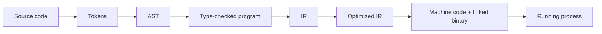

# HC.2 How Code Becomes Execution

## Mission

Understand the journey from Go source code to a running program: tokens, AST, type checking, IR, optimization, code generation, and linking.

## Prerequisites

- `HC.1` what is a program

## Mental Model

Think of the compiler as a translation pipeline.

You write text for humans. The compiler progressively turns that text into representations that are easier for machines to reason about, optimize, and finally execute.

## Visual Model



## Machine View

The CPU does not run `.go` files. It runs machine instructions. Between those two things, Go performs a complex build pipeline:

1. **Lexing**: Breaks the source text into "Tokens" (like words in a sentence).
2. **Parsing**: Builds an **Abstract Syntax Tree (AST)** to understand the grammar of your code.
3. **Type Checking**: Verifies that operations are compatible. This is where most "compile-time" errors are caught.
4. **IR Generation**: Creates an Intermediate Representation. This is a generic "pseudo-machine code" that Go uses for architecture-independent logic.
5. **Optimization**: Rewrites the IR to make it faster (e.g., removing unused variables or simplifying math).
6. **Code Generation**: Translates the optimized IR into the specific **OpCodes** for your CPU (AMD64, ARM64, etc.).
7. **Linking**: Combines your code with standard library code and resolves the memory addresses for every function call.

> [!NOTE]
> This pipeline is the direct solution to the gap between human logic and the binary OpCodes introduced in [HC.1 What is a Program?](../01-what-is-a-program/README.md).

## Run Instructions

```bash
go run ./00-how-computers-work/02-code-to-execution
```

## Code Walkthrough

- **Source text**: This is the input to the compiler.
- **Tokens**: The first stage of machine understanding.
- **AST Shape**: Represents the hierarchical structure of the logic.
- **Final Result**: The binary artifact that the OS loads into memory for the CPU to fetch.

## Try It

1. Run the lesson and read each stage as a transformation, not just decoration.
2. Change the example expression in `main.go` and update the printed stages to match.
3. Compare `go run` with `go build` and explain what extra thing `go build` leaves behind in your directory.

## In Production

Build artifacts are the unit of deployment. When you deploy Go, you deploy a compiled binary for the target OS and CPU architecture. You do not need the Go compiler on your production servers; the binary contains the final machine code, linked and ready for the CPU.

## Thinking Questions

1. Why is IR useful instead of compiling source text directly into machine instructions in one step?
2. Why does compile-time type checking remove whole categories of runtime failures?
3. If two source files produce the same AST, what differences between the files stop mattering to the compiler?

## Next Step

Next: `HC.3` -> [`00-how-computers-work/03-memory-basics`](../03-memory-basics/README.md)
