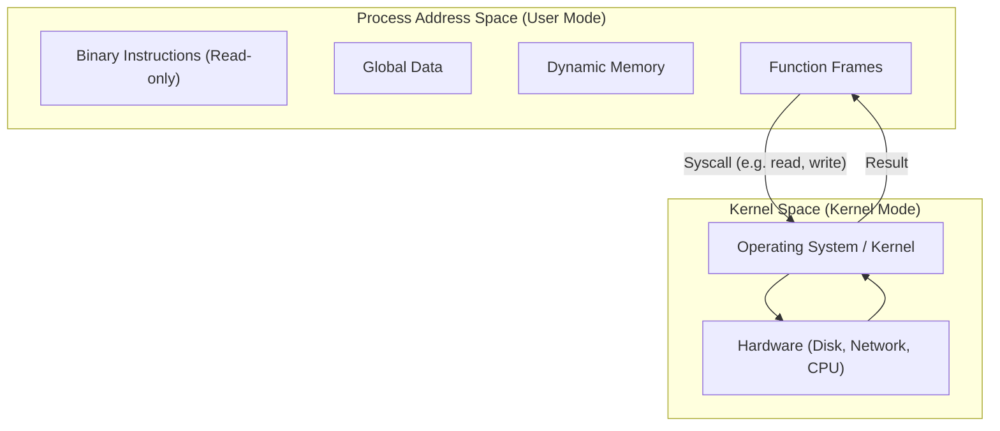

# HC.5 How the OS Manages Processes

## Mission

Understand that your Go program runs inside an operating-system process and crosses a syscall boundary whenever it needs OS help.

## Prerequisites

- `HC.4` terminal confidence

## Mental Model

A **Process** is the OS "Sandbox" for a running program. It provides isolation so that if one program crashes, it doesn't take the whole computer down with it.

**Syscalls** (System Calls) are the doors that let that sandbox ask the OS for help with things it cannot do alone, such as:
- Reading or writing a file.
- Sending data over the network.
- Checking the current time.

## Visual Model



## Machine View

The OS enforces a boundary between **User Mode** (where your app runs) and **Kernel Mode** (where hardware is managed). Your program is physically blocked from touching the disk or network directly.

- **Isolation**: Each process has its own virtual memory. This is why a memory leak in one process doesn't corrupt another.
- **The Syscall Boundary**: When you call `os.Open`, the Go runtime executes a special CPU instruction that switches the CPU into Kernel Mode so the OS can safely perform the request.
- **Context Switching**: The OS scheduler rapidly swaps processes on and off the CPU cores.

> [!NOTE]
> The File Descriptors introduced in [HC.4 Terminal Confidence](../04-terminal-confidence/README.md) are managed by the kernel as part of the process address space.

> [!NOTE]
> When the OS needs to stop a process, it sends a **Signal**. You will learn to handle these for "Graceful Shutdowns" in [GS.1 Signals and Context](../../10-production/02-graceful-shutdown/README.md).

## Run Instructions

```bash
go run ./00-how-computers-work/05-os-processes
```

## Code Walkthrough

- **os.Getpid()**: Shows your unique Process ID.
- **os.Getppid()**: Shows the parent process (usually your shell).
- **os.Hostname()**: A classic syscall. Your app asks the kernel for the system's identity.

## Try It

1. Run the lesson and note the PID. 
2. Open another terminal and run `ps -p [YOUR_PID]` (on Unix) or `Get-Process -Id [YOUR_PID]` (on Windows) to see the OS view of your program.
3. Explain why the program cannot know its own PID without asking the OS.

## In Production

Every microservice is a process. In cloud environments, we use process signals like `SIGTERM` to signal a service to stop accepting new requests and finish its current work before the container is killed.

## Thinking Questions

1. Why does the OS isolate one process from another?
2. What would happen if a program could write directly to the disk without using a syscall?
3. Why are file descriptors tied to a specific process?

## Next Step

Next: `GT.1` -> [`01-getting-started/01-installation`](../../01-getting-started/01-installation/README.md)
