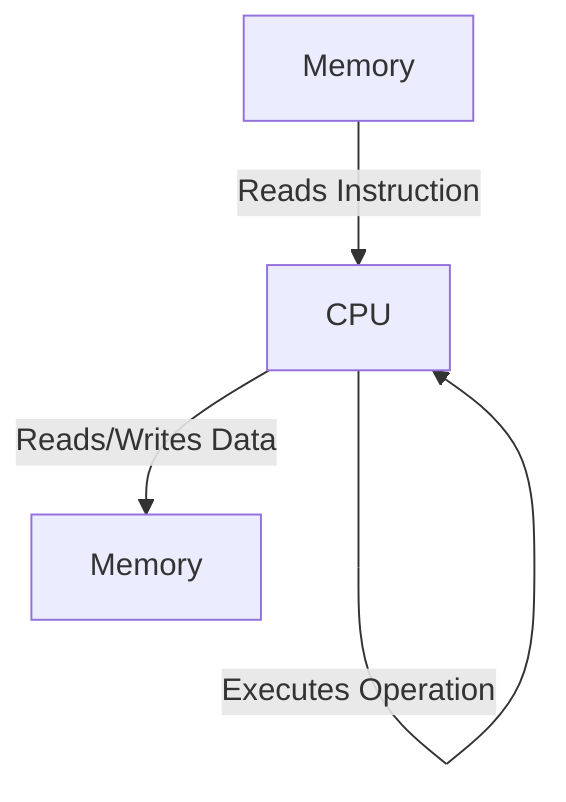

# HC.1 What Is a Program?

## Mission
Understand that a program is a list of instructions for a machine to follow, and the CPU runs a continuous loop to execute them.

## Prerequisites
- None

## Mental Model
Imagine a cook reading a recipe card. The recipe is the program, the ingredients are the data, and the cook is the CPU following one instruction at a time.

## Visual Model


## Machine View
Computers only understand binary (1s and 0s). The CPU uses the fetch-decode-execute cycle billions of times per second. It fetches an instruction from memory, decodes it into basic operations (Move, Add, Compare, Jump, Read, Write), and executes it. 

Your program and your data are both stored in the same memory (Von Neumann architecture).

## Run Instructions
*(This is a conceptual lesson, no code to run)*

## Code Walkthrough
```go
// You write:
fmt.Println("Hello")

// CPU executes binary equivalent of:
// 1. Move pointer to string
// 2. Call print function
// 3. Return to next instruction
```

## Try It
1. Think about what happens when your computer runs out of memory. Based on the machine view, why does the entire system slow down or crash?

## ⚠️ In Production
Because programs are stored in memory just like data, security vulnerabilities often occur when a program is tricked into interpreting malicious data as instructions (e.g., buffer overflows).

## 🤔 Thinking Questions
1. If the CPU can only do six basic operations, why do some programs run slowly?
2. You've heard that computers "process" things. Based on what you now know, what is processing actually? What's physically happening?
3. If your program is stored in memory like data, what happens if you run the same program twice at the same time?

## Next Step
[HC.2 How Code Becomes Execution](../2-compilation-journey)
