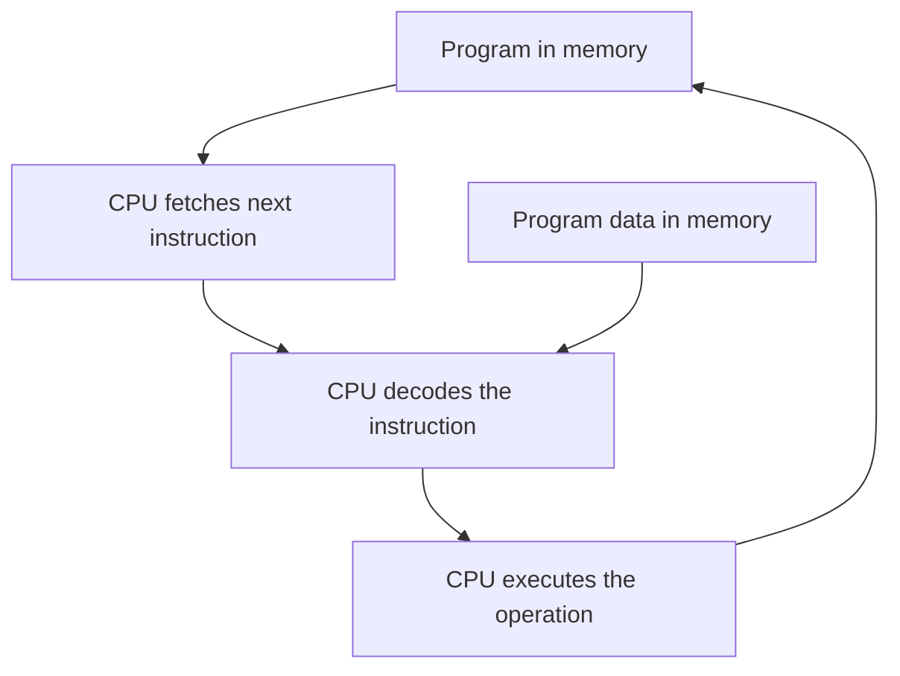

# HC.1 What Is a Program?

## Mission

Understand that a program is a list of instructions for a machine to follow, and that the CPU runs a continuous fetch-decode-execute loop to carry those instructions out.

## Prerequisites

- None

## Mental Model

Imagine a cook reading a recipe card.

- the recipe card is the program
- the ingredients are the data
- the cook is the CPU

The cook does not understand your intent. The cook only follows one instruction at a time. If the recipe says "add salt" 100 times, the cook will do it, even if it ruins the meal.

## Visual Model



## Machine View

Computers only understand one language: binary. Every Go function you write eventually decomposes into a series of numeric codes called **OpCodes** (Operation Codes) stored in RAM.

The CPU uses a special internal register called the **Instruction Pointer (IP)** or Program Counter to keep track of where it is in that list.

| Operation | What it means                          |
| --------- | -------------------------------------- |
| Move      | Copy a value from one place to another |
| Add       | Combine numeric values                 |
| Compare   | Check whether values match or differ   |
| Jump      | Change which instruction runs next     |
| Read      | Load a value from memory               |
| Write     | Store a value back into memory         |

The fetch-decode-execute cycle is the "heartbeat" of the machine:
1. **Fetch**: The CPU retrieves the OpCode at the address pointed to by the Instruction Pointer.
2. **Decode**: The CPU determines which hardware circuitry is needed to perform that specific OpCode.
3. **Execute**: The CPU performs the operation and increments the Instruction Pointer to the next address.

> [!NOTE]
> This fetch-decode-execute cycle is the foundation for understanding how the Go compiler translates source text into executable OpCodes in [HC.2 Code to Execution](../2-code-to-execution/README.md).

## Run Instructions

```bash
go run ./00-how-computers-work/1-what-is-a-program
```

## Verification Surface

When you run the command above, you should see the following output on your screen:

```text
A program is a list of instructions for the machine.
The CPU keeps fetching, decoding, and executing those instructions.
Even this printed text is just the visible effect of that loop.
```

## Code Walkthrough

- **Instruction Sequence**: Notice how the `fmt.Println` calls execute in the exact order they are written. This represents the linear fetching of instructions by the CPU's Instruction Pointer.
- **Data vs Code**: The strings passed to `Println` are the *data*, while the `Println` function itself is a call to a sequence of *instructions* in the Go runtime.

## Try It

1. Run the lesson once and read the output as a machine model, not just a greeting.
2. Add one more `fmt.Println(...)` line and rerun it.
3. Explain why the new line appears only after the earlier instructions finish.

## In Production

Programs are stored in memory just like data. This is why memory corruption bugs (like Buffer Overflows) are dangerous. If an attacker can overwrite a piece of data memory with their own OpCodes and trick the Instruction Pointer into jumping to that address, they have taken control of your process.

## Thinking Questions

1. If the CPU can only do a few primitive instruction types, why do some programs still run slowly?
2. What does "the computer is processing data" physically mean now that you know about the CPU loop?
3. If you run the same program twice at the same time, what do you think the OS duplicates and what does it share?

## Next Step

Next: `HC.2` -> [`00-how-computers-work/2-code-to-execution`](../2-code-to-execution/README.md)
