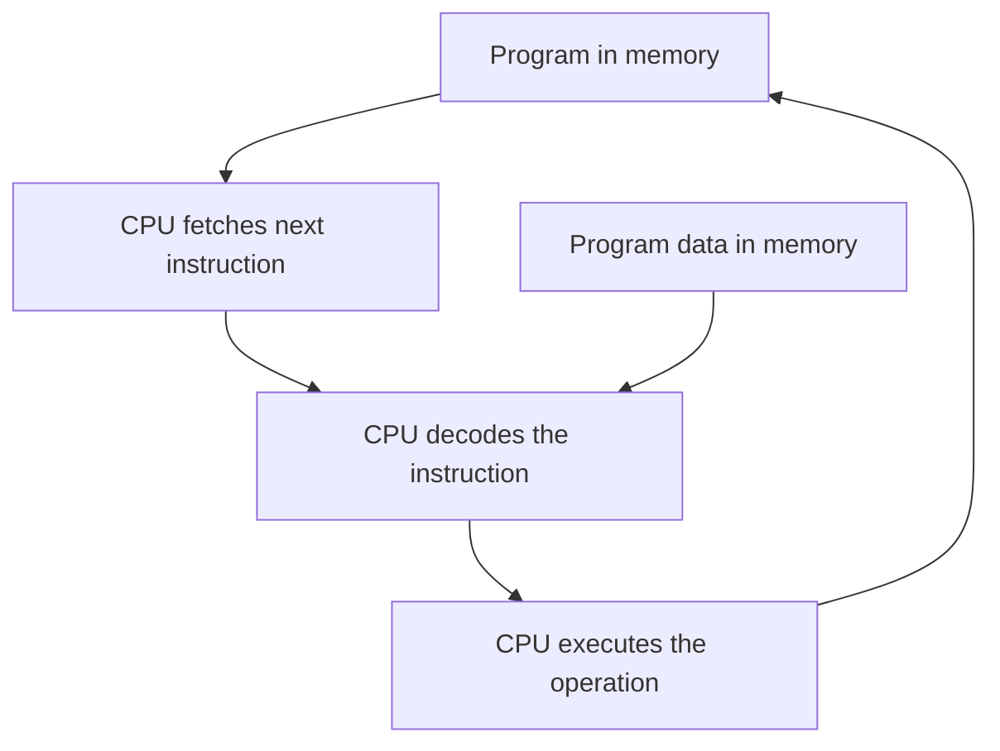

# HC.1 What Is a Program?

## Mission

Understand that a program is a list of instructions for a machine to follow, and that the CPU runs a continuous fetch-decode-execute loop to carry those instructions out.

## Prerequisites

- None

## Mental Model

Imagine a cook reading a recipe card.

- the recipe card is the program
- the ingredients are the data
- the cook is the CPU

The cook does not understand your intent.
The cook only follows one instruction at a time.

## Visual Model



## Machine View

Computers only understand one language: binary.
That is why we need layers between Go code and the hardware.

At a high level, every program eventually decomposes into a small set of instruction families:

| Operation | What it means                          |
| --------- | -------------------------------------- |
| Move      | Copy a value from one place to another |
| Add       | Combine numeric values                 |
| Compare   | Check whether values match or differ   |
| Jump      | Change which instruction runs next     |
| Read      | Load a value from memory               |
| Write     | Store a value back into memory         |

Your program is also data.
The CPU reads instructions from memory, then reads and writes the data those instructions operate on.

That is why the fetch-decode-execute cycle matters:

1. fetch the next instruction from memory
2. decode what that instruction means
3. execute it
4. move to the next instruction

## Run Instructions

```bash
go run ./00-how-computers-work/1-what-is-a-program
```

## Code Walkthrough

In `main.go`, the demo prints a few simple statements, but the important part is what those prints represent:

- the compiled program is already a list of machine instructions
- the CPU fetches those instructions in order
- each `fmt.Println(...)` call only appears because the CPU repeatedly executes that loop

## Try It

1. Run the lesson once and read the output as a machine model, not just a greeting.
2. Add one more `fmt.Println(...)` line and rerun it.
3. Explain why the new line appears only after the earlier instructions finish.

## In Production
Programs are stored in memory just like data.
That is one reason memory corruption bugs and instruction/data confusion can become security problems.

## Thinking Questions
1. If the CPU can only do a few primitive instruction types, why do some programs still run slowly?
2. What does “the computer is processing data” physically mean now that you know about the CPU loop?
3. If you run the same program twice at the same time, what do you think the OS duplicates and what does it share?

## Next Step

Next: `HC.2` -> `00-how-computers-work/2-code-to-execution`

Open `00-how-computers-work/2-code-to-execution/README.md` to continue.
