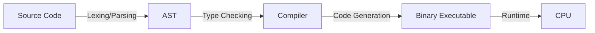

# HC.2 How Code Becomes Execution

## Mission
Understand the journey from human-readable text to executable machine binary, and what the compiler does.

## Prerequisites
- `HC.1` What Is a Program?

## Mental Model
Think of the compiler as a translator. You write a book in English, and the translator breaks it into words (lexing), understands the sentences (parsing), checks for grammar errors (type checking), and finally writes a completely new book in French (code generation) that the reader (CPU) natively understands.

## Visual Model


## Machine View
Go is a statically typed, compiled language. 
1. **Lexing:** Breaks code into tokens.
2. **Parsing:** Builds an Abstract Syntax Tree (AST).
3. **Type Checking:** Validates types before the code ever runs.
4. **Code Generation:** Translates the AST into native machine code for the target CPU.
5. **Linking:** Combines your code with other packages (statically linked).

## Run Instructions
*(This is a conceptual lesson, no code to run)*

## Code Walkthrough
```go
// x := 42 + y
// Becomes tokens: IDENTIFIER("x") DEFINE(:=) NUMBER(42) PLUS(+) IDENTIFIER("y")
```

## Try It
1. Run `go run main.go` on any Go file. Realize that it is silently compiling and running a binary in the background.

## ⚠️ In Production
**Build artifacts matter.** When you deploy Go to production, you're deploying the *compiled binary*, not source code. This means the binary must be compiled for the target OS and CPU architecture (`GOOS=linux GOARCH=amd64 go build`). Different machines may need different binaries.

## 🤔 Thinking Questions
1. Python catches type errors when the code runs. Go catches them at compile time. If you were building a payment service, which would you prefer? Why?
2. Go produces a single static binary. What operational advantage does this give you when deploying to 1,000 servers?
3. The AST represents the meaning of your code, not the exact characters. Can you think of a case where two different-looking programs have identical ASTs?

## Next Step
[HC.3 Memory Basics](../3-memory-basics)
