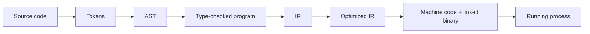

# HC.2 How Code Becomes Execution

## Mission

Understand the journey from Go source code to a running program: tokens, AST, type checking, IR, optimization, code generation, and linking.

## Prerequisites

- `HC.1` what is a program

## Mental Model

Think of the compiler as a translation pipeline.

You write text for humans.
The compiler progressively turns that text into representations that are easier for machines to reason about, optimize, and finally execute.

## Visual Model



## Machine View

The CPU does not run `.go` files.
It runs machine instructions.

Between those two things, Go performs a build pipeline:

1. **Lexing** breaks text into tokens.
2. **Parsing** builds an Abstract Syntax Tree (AST).
3. **Type checking** verifies operations and types are compatible.
4. **IR generation** creates an intermediate representation that is easier to optimize.
5. **Optimization** improves the generated program before final code generation.
6. **Code generation** emits machine instructions for the target CPU.
7. **Linking** combines your code with the compiled packages it depends on.

That is why Go catches many mistakes before the program ever starts.

## Run Instructions

```bash
go run ./00-how-computers-work/2-code-to-execution
```

## Code Walkthrough

The lesson program prints one tiny example through each stage:

- original source text
- tokenized representation
- AST shape
- IR-style operation sequence
- final machine-oriented result

It is not a real compiler.
It is a guided mental model of what the real compiler is doing.

## Try It

1. Run the lesson and read each stage as a transformation, not as decoration.
2. Change the example expression in `main.go` and update the printed stages to match.
3. Compare `go run` with `go build` and explain what extra thing `go build` leaves behind.

## In Production
Build artifacts matter.
When you deploy Go, you deploy the compiled binary for the target OS and CPU architecture, not the source files.

## Thinking Questions
1. Why is IR useful instead of compiling source text directly into machine instructions in one step?
2. Why does compile-time type checking remove whole categories of runtime failures?
3. If two source files produce the same AST, what differences between the files stop mattering to the compiler?

## Next Step

Next: `HC.3` -> `00-how-computers-work/3-memory-basics`

Open `00-how-computers-work/3-memory-basics/README.md` to continue.
