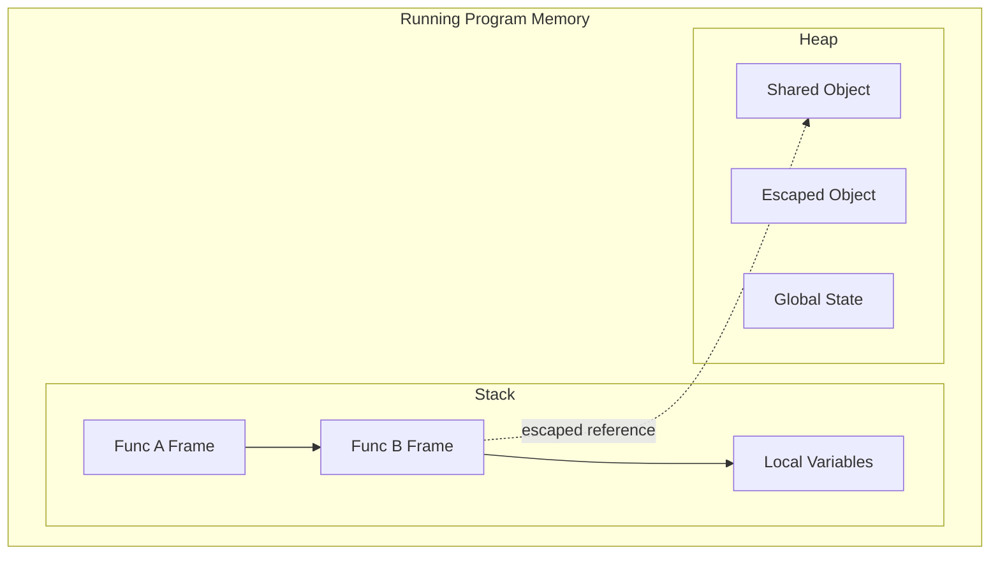

# HC.3 Memory Basics: Stack and Heap

## Mission

Understand how memory is allocated and managed during execution, especially the difference between stack and heap memory in Go.

## Prerequisites

- `HC.2` how code becomes execution

## Mental Model

**The Stack** is like a neat stack of plates in a busy restaurant.
- **Fast**: You just put a plate on top or take one off.
- **Automatic**: When a function finishes, its "plate" is removed and the memory is immediately recycled.
- **Private**: In Go, **every goroutine has its own stack**.

**The Heap** is like a large shared storage room.
- **Flexible**: You can put something there and it stays as long as you need it.
- **Shared**: Multiple goroutines can access the same data on the heap.
- **Managed**: Because it's not self-cleaning, Go needs a **Garbage Collector (GC)** to clean up unreachable objects.

## Visual Model



## Machine View

Every function call creates a **stack frame** on the current goroutine's stack. Unlike languages like C or Java where stacks are a fixed size (often 1MB), **Go stacks start small (2KB) and grow/shrink as needed**.

**Heap memory** is used for objects that outlive the function that created them or are too large for the stack.

Go's compiler uses **Escape Analysis** to decide where to put a variable:
- If a variable's lifetime is entirely contained within a function, it stays on the **Stack**.
- If a pointer to a variable is returned or shared, it "escapes" to the **Heap**.

> [!TIP]
> At high scale, excessive heap allocation creates Garbage Collector pressure. You can learn how to profile and optimize memory layout in [PR.6 Memory Layout](../../08-quality-test/01-quality-and-performance/profiling/6-memory-layout/README.md).

> [!NOTE]
> Because the heap is shared memory, concurrent access to heap objects requires synchronization, which we cover in [SY.1 Mutex & RWMutex](../../07-concurrency/01-concurrency/sync-primitives/1-mutex-and-rwmutex/README.md).

## Run Instructions

```bash
go run ./00-how-computers-work/3-memory-basics
```

## Code Walkthrough

- **noEscape()**: Returns a value directly. The compiler can keep `x` on the stack because no one outside the function needs a reference to its specific memory address.
- **escapes()**: Returns a *pointer*. Because the caller needs to access the memory address of `x` after the function is gone, the compiler moves `x` to the heap.

## Common Mistakes

### Over-using Pointers for Small Values
Many beginners think using pointers (`*int`, `*string`) is always faster because it "avoids copying."
- **The Bug:** Passing pointers to small, local variables that don't need to be shared.
- **The Consequence:** You force the variable to "escape" to the heap, which is actually **slower** than a fast stack copy because it creates work for the Garbage Collector.

### Thinking the Stack is Shared
Unlike the heap, the stack is private to each goroutine.
- **The Mistake:** Expecting that a pointer to a stack-local variable can be safely shared across goroutines without it escaping.
- **The Reality:** As soon as you share that address with another goroutine, the compiler sees that the variable "outlives" the current function and moves it to the heap anyway.

## Try It

1. Run the lesson and compare the value-returning function with the pointer-returning one.
2. Add another helper that returns a slice and explain why its backing storage may outlive the function.
3. Run `go build -gcflags='-m' ./00-how-computers-work/3-memory-basics` and read the compiler's escape-analysis hints in the terminal.

## In Production

Performance-critical Go code often tries to keep objects on the stack. The heap is powerful but expensive. Heavy heap use triggers the GC, which uses CPU cycles and can introduce "latency spikes."

## Thinking Questions

1. Why does the heap need a garbage collector while the stack does not?
2. Can a garbage-collected language still leak memory? If so, how?
3. Why do goroutine stacks start small and grow instead of reserving a huge stack up front?

## Next Step

Next: `HC.4` -> [`00-how-computers-work/4-terminal-confidence`](../4-terminal-confidence/README.md)
