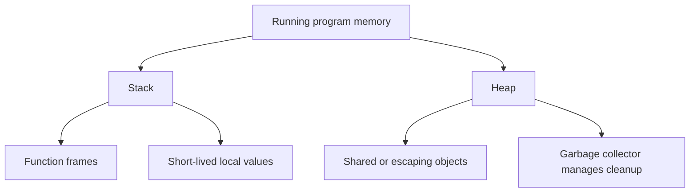

# HC.3 Memory Basics: Stack and Heap

## Mission

Understand how memory is allocated and managed during execution, especially the difference between stack and heap memory in Go.

## Prerequisites

- `HC.2` how code becomes execution

## Mental Model

The stack is like a neat stack of plates: fast, ordered, and easy to clean up.

The heap is like a shared storage room: flexible and useful, but it needs active management so old objects do not stay around forever.

## Visual Model



## Machine View

Every function call creates a stack frame.
That frame holds the local state needed while the function is active.

Heap memory is different:

- it is allocated dynamically
- objects can outlive the function that created them
- Go's garbage collector frees unreachable heap objects later

Go also performs **escape analysis**.
If a value must outlive the current function, the compiler moves it to the heap automatically.

## Run Instructions

```bash
go run ./00-how-computers-work/3-memory-basics
```

## Code Walkthrough

The lesson program shows two small cases:

- `noEscape()` returns a value directly, so the compiler can often keep it in stack-managed memory
- `escapes()` returns a pointer, so the pointed-to value must outlive the function and is a candidate for heap allocation

The demo is intentionally small.
The goal is to make the stack/heap distinction explainable before later performance lessons.

## Try It

1. Run the lesson and compare the value-returning function with the pointer-returning one.
2. Add another helper that returns a slice and explain why its backing storage may outlive the function.
3. Run `go build -gcflags='-m' ./00-how-computers-work/3-memory-basics` and read the compiler's escape-analysis hints.

## In Production
Heavy heap allocation creates garbage-collector pressure.
That is one reason hot paths often avoid unnecessary temporary objects.

## Thinking Questions
1. Why does the heap need a garbage collector while the stack usually does not?
2. Can a garbage-collected language still leak memory? If so, how?
3. Why do goroutine stacks start small and grow instead of reserving a huge stack up front?

## Next Step

Next: `HC.4` -> `00-how-computers-work/4-terminal-confidence`

Open `00-how-computers-work/4-terminal-confidence/README.md` to continue.
