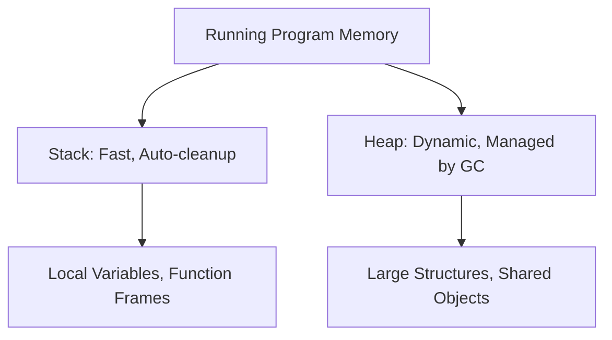

# HC.3 Memory Basics: Stack and Heap

## Mission
Understand how memory is allocated and managed during program execution using the stack and heap.

## Prerequisites
- `HC.2` How Code Becomes Execution

## Mental Model
The **Stack** is like a stack of plates: organized, fast, last-in-first-out. The **Heap** is like a messy desk: flexible, unorganized, things stay until you clean them up.

## Visual Model


## Machine View
Every time a function is called, a stack frame is pushed. When it returns, it's popped. Stack size is fixed and fast. 
Heap memory is dynamically allocated. Go's Garbage Collector (GC) runs periodically to find and clean up heap objects that are no longer referenced (mark-and-sweep).
Go's compiler uses **escape analysis** to determine if a variable should live on the stack or "escape" to the heap.

## Run Instructions
*(This is a conceptual lesson, no code to run)*

## Code Walkthrough
```go
func noEscape() int {
    x := 42      // Used only here, stays on stack
    return x     // Value is copied out, not a pointer
}

func escapes() *int {
    x := 42      // Must be on heap — we return a pointer to it
    return &x    // The value "escapes" the function
}
```

## Try It
1. Think about why a Garbage Collector is needed for the heap but not the stack.

## ⚠️ In Production
**GC pressure is a real performance issue.** If your code allocates heavily in hot paths, you're putting enormous pressure on the GC. Senior engineers minimise heap allocations in critical paths — pre-allocating slices, using `sync.Pool`, reusing buffers.

## 🤔 Thinking Questions
1. A function creates a large slice and returns it. Does it go on the stack or heap? Why?
2. If Go has a garbage collector, can you still have memory leaks? Think carefully.
3. Why do you think Go goroutine stacks start at just 2KB when OS thread stacks are typically 1–8MB? What problem does this solve?

## Next Step
[HC.4 Terminal Confidence](../4-terminal-confidence)
