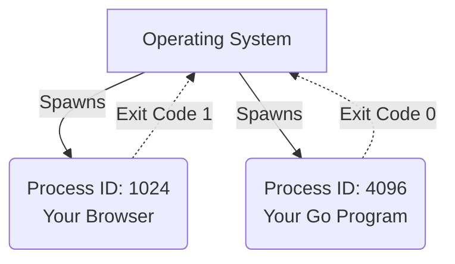

# HC.5

## Mission

Understand what a "process" is, how the Operating System tracks it, and how programs report success or failure back to the OS.

## Prerequisites

- `HC.4`

## Mental Model

When you run a binary file, the OS creates a **Process**. A process is simply an active, running instance of your program. 

Your computer is running hundreds of processes right now (your browser, your music player, background system tasks). To keep track of them, the OS assigns every single process a unique **Process ID (PID)**.

When a process finishes its work, it must tell the OS whether it succeeded or crashed. It does this by returning an **Exit Code**:
- `0` means "I finished successfully. Everything is fine."
- Any other number (like `1`) means "I failed or crashed."

## Visual Model



## Machine View

The OS acts like a strict manager. It gives your process its own private memory (the heap/stack we learned about in HC.3), so it cannot accidentally overwrite another program's memory. When your process exits, the OS forcefully reclaims all the memory your process was using.

## Run Instructions

```bash
go run ./00-how-computers-work/5-os-processes
```

## Code Walkthrough

In this code:
1. We ask the OS to tell us what Process ID it assigned to our running program (`os.Getpid()`).
2. We print the PID so you can see it.
3. We manually force the program to stop and report an exit code of `0` back to the OS, declaring total success (`os.Exit(0)`).

## Try It

1. Run the program multiple times. Notice that the OS gives your program a different PID every single time you start it!
2. Change `os.Exit(0)` to `os.Exit(1)`, and run it again. Notice how `go run` prints an error message (`exit status 1`)? That is the Go toolchain catching your failure code!

## Next Step

Congratulations. You now have a stronger mental model of computer hardware, memory, and the OS than many self-taught developers. You are no longer casting spells—you are writing instructions for a machine.

It is time to move to **Section 1**, where we will ensure your Go installation is flawless. Move to [GT.1 Installation](../../01-getting-started/1-installation/).
