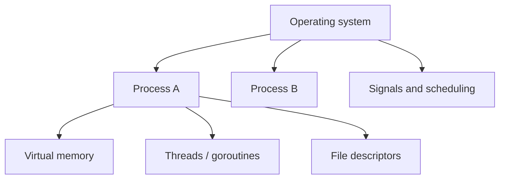

# HC.5 How the OS Manages Processes

## Mission

Understand that your Go program runs inside an operating-system process with its own memory view, file descriptors, signals, and scheduling.

## Prerequisites

- `HC.4` terminal confidence

## Mental Model

A process is a sandbox the OS gives to a running program.
It feels like the program has its own machine, even though the OS is sharing real hardware with many other processes.

## Visual Model



## Machine View

An OS process includes more than just your code:

- virtual memory
- CPU execution state
- open file descriptors
- environment variables
- identity like PID and parent PID

The OS scheduler decides when a process or thread runs.
Signals like `SIGINT` and `SIGTERM` let the OS or the terminal communicate with that process asynchronously.

## Run Instructions

```bash
go run ./00-how-computers-work/5-os-processes
```

## Code Walkthrough

The lesson prints the current process ID.
That is enough to make one key truth visible: your Go program is not special to the OS.
It is just another process the OS launched and tracks.

## Try It

1. Run the lesson and note the PID it prints.
2. In another terminal, find that PID with your platform's process tools.
3. Press `Ctrl+C` on a long-running foreground program and explain which signal the terminal sent.

## ⚠️ In Production

Your deployed service is a process.
Graceful shutdown, open-connection limits, and signal handling all depend on understanding that fact.

## 🤔 Thinking Questions

1. Why does virtual memory make it harder for one buggy process to corrupt another?
2. What is the difference between an OS thread and a Go goroutine?
3. What problems appear if a process never closes file descriptors it no longer needs?

## Next Step

Continue to [HC.6 CPU Cache and Performance](../6-cpu-cache-and-performance).
