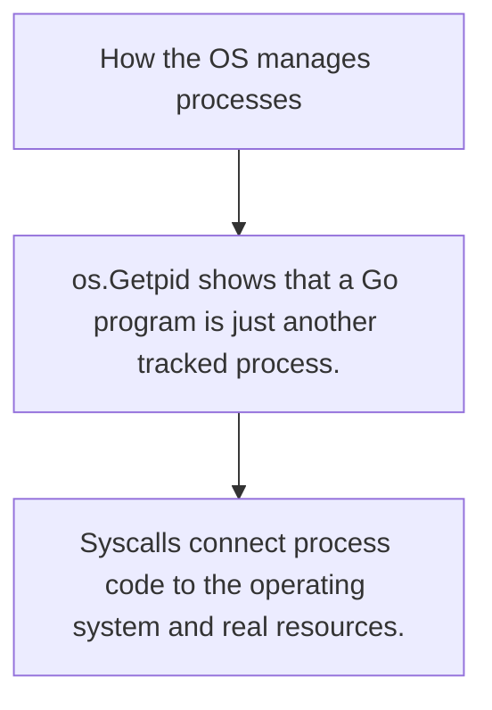

# HC.5 How the OS manages processes

## Mission

Understand that your Go program runs inside an operating-system process and crosses a syscall boundary whenever it needs OS help.

## Prerequisites

- HC.4

## Mental Model

A process is the OS sandbox for a running program. Syscalls are the doors that let that sandbox ask for files, network access, clocks, and other external work.

## Visual Model



## Machine View

An OS process owns virtual memory, CPU state, descriptors, and identity like PID. Syscalls are how that process asks the kernel to act on its behalf.

## Run Instructions

```bash
go run ./00-how-computers-work/5-os-processes
```

## Code Walkthrough

### os.Getpid shows that a Go program is just another trac

os.Getpid shows that a Go program is just another tracked process.

### os.Getppid reveals the parent-child relationship betwe

os.Getppid reveals the parent-child relationship between processes.

### Syscalls connect process code to the operating system 

Syscalls connect process code to the operating system and real resources.

## Try It

1. Run the lesson and compare the PID with your terminal's process tools.
2. Open another terminal and inspect the parent process relationship.
3. Name three operations your program cannot perform without the OS helping.

## In Production
Every deployed service is a process. Signals, open files, sockets, and syscall costs all matter once the code leaves your laptop.

## Thinking Questions
1. Why does the OS isolate one process from another?
2. What kinds of work require crossing the syscall boundary?
3. Why are file descriptors and sockets process resources rather than plain language values?

## Next Step

Continue to `GT.1`.
