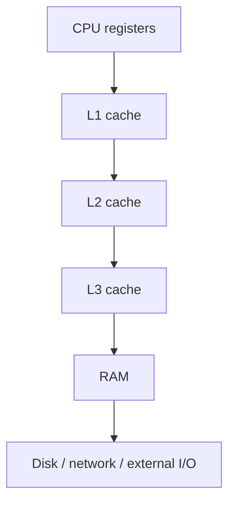

# HC.6 CPU Cache and Performance

## Mission

Understand why modern programs are often limited by memory access rather than raw arithmetic, and how the cache hierarchy changes performance.

## Prerequisites

- `HC.5` how the OS manages processes

## Mental Model

The CPU is extremely fast.
Main memory is much slower.

Cache exists so the CPU can keep nearby or recently used data close at hand instead of waiting on RAM every time.

## Visual Model



## Machine View

Programs benefit from two important locality rules:

- **temporal locality**: if you used data recently, you may use it again soon
- **spatial locality**: if you used one memory address, nearby addresses may be useful next

That is why sequential access patterns often beat random access patterns even when both do the same number of logical operations.

## Run Instructions

```bash
go run ./00-how-computers-work/6-cpu-cache-and-performance
```

## Code Walkthrough

The demo sums the same data in two ways:

- one pass walks memory in order
- one pass walks memory through a shuffled index list

Both are simple loops.
The difference is whether the CPU can predict and reuse nearby data efficiently.

## Try It

1. Run the lesson a few times and compare the two timings.
2. Increase the data size in `main.go` and rerun it.
3. Explain why the slower version is not doing “more math” even when it takes longer.

## ⚠️ In Production

Cache misses are a hidden performance tax.
Good algorithms still matter, but real systems also care about data layout and memory access patterns.

## 🤔 Thinking Questions

1. Why can two loops with the same number of additions have very different runtimes?
2. What kinds of code naturally produce poor cache locality?
3. Why does “the CPU is fast” not automatically mean “the program is fast”?

## Next Step

Continue to [HC.7 Syscalls](../7-syscalls).
