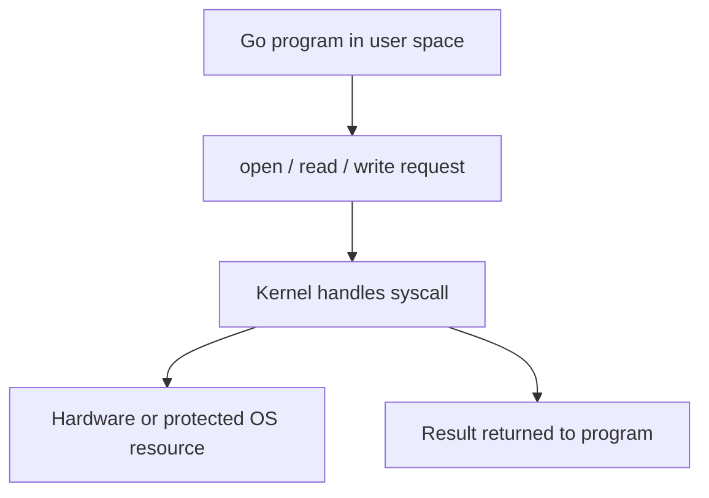

# HC.7 Syscalls

## Mission

Understand that user-space programs do not talk to hardware directly. They ask the operating system to do privileged work through system calls.

## Prerequisites

- `HC.6` CPU cache and performance

## Mental Model

Your Go program lives in user space.
The operating system lives in kernel space.

When your program needs to open a file, read bytes, write to the network, or allocate certain resources, it must cross that boundary and ask the OS for help.

## Visual Model



## Machine View

System calls are the boundary between ordinary program execution and privileged OS work.

Common examples include:

- opening files
- reading and writing bytes
- creating sockets
- starting processes

The call itself is not “magic.”
It is a controlled transition into kernel mode so the OS can safely perform work your program is not allowed to do on its own.

## Run Instructions

```bash
go run ./00-how-computers-work/7-syscalls
```

## Code Walkthrough

The demo creates a temporary file, writes bytes to it, reads them back, and removes the file.
The Go code uses `os` helpers, but those helpers eventually reach the OS through syscalls.

## Try It

1. Run the lesson and inspect the read/write flow in the output.
2. Change the string being written and rerun it.
3. Explain which parts are pure Go logic and which parts require the OS to step in.

## ⚠️ In Production

Syscalls are comparatively expensive because they cross the user/kernel boundary.
That is one reason buffering, batching, and connection reuse matter in real systems.

## 🤔 Thinking Questions

1. Why does opening a file need OS involvement instead of direct CPU access from your program?
2. Why might lots of tiny reads and writes perform worse than buffered I/O?
3. What safety problems would appear if every user program could talk to hardware directly?

## Next Step

Continue to [HC.8 Blocking vs Non-Blocking I/O](../8-blocking-vs-non-blocking-io).
