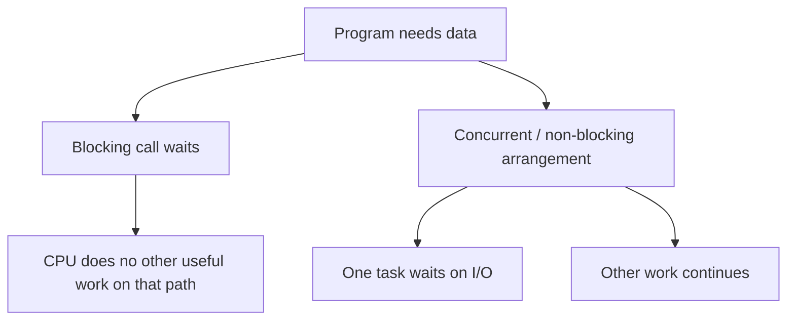

# HC.8 Blocking vs Non-Blocking I/O

## Mission

Understand why many programs are slow because they wait on I/O, and how concurrency lets useful work continue while something slow is still pending.

## Prerequisites

- `HC.7` syscalls

## Mental Model

Blocking I/O means the current line of execution stops and waits.

Non-blocking or concurrent I/O means the program arranges work so that waiting on one thing does not freeze everything else.

## Visual Model



## Machine View

Disks, networks, and many external systems are slow compared with the CPU.
If a program performs a blocking read, the current execution path stops until the data arrives.

Go often hides that pain with goroutines and a runtime scheduler:

- one goroutine can wait
- another goroutine can keep making progress

That does not make the I/O itself fast.
It just means the whole program does not have to stall in one place.

## Run Instructions

```bash
go run ./00-how-computers-work/8-blocking-vs-non-blocking-io
```

## Code Walkthrough

The demo measures two tiny scenarios:

- a blocking path that waits, then works
- a concurrent path where one goroutine waits while the main goroutine does other work

The point is not precise benchmarking.
The point is making “waiting vs working” visible.

## Try It

1. Run the lesson and compare the blocking time with the concurrent version.
2. Increase the artificial delay in `slowIO()` and rerun it.
3. Explain why concurrency helps overlap waiting even though the slow operation itself still takes time.

## ⚠️ In Production

Many backend services are I/O-bound.
They spend more time waiting on databases, networks, and disks than performing arithmetic.

## 🤔 Thinking Questions

1. Why can a program with very little CPU work still feel slow to users?
2. What is the difference between “non-blocking” and “instant”?
3. Why does Go's concurrency model make waiting-heavy programs easier to structure?

## Next Step

Continue to [GT.1 Installation Verification](../../01-getting-started/1-installation).
