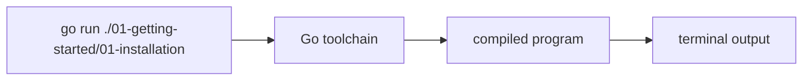

# GT.1 Installation Verification

## Mission

Confirm that Go is installed and that this machine can run a real Go program from this repo.

## Prerequisites

- None.

## Mental Model

`go run` is a short pipeline:

1. Read the source files.
2. Compile them into a runnable program.
3. Execute that program.
4. Show the output in the terminal.

If this lesson runs, the basic toolchain is healthy.

> [!NOTE]
> The `go run` command is executed within the terminal environment you mastered in [HC.4 Terminal Confidence](../../00-how-computers-work/04-terminal-confidence/README.md).

> [!TIP]
> This repository is organized as a Go Module. While we run individual files now, you will learn how Go manages complex multi-file projects in [MP.1 Module Basics](../../05-packages-io/01-modules-and-packages/01-module-basics/README.md).

## Visual Model



## Machine View

This lesson reads values from Go's `runtime` package. The running binary asks the current process what Go version, OS, architecture, and CPU count it sees, then prints those facts to standard output.

## Run Instructions

```bash
go run ./01-getting-started/01-installation
```

## Code Walkthrough

- **`package main`**: This file belongs to the executable package, so `go run` can build and launch it.
- **`import ("fmt" "runtime")`**: `fmt` prints human-readable output. `runtime` exposes facts about the running program and machine.
- **`runtime.Version()`**: This reports which Go toolchain built the program you are currently executing.
- **`runtime.GOOS` and `runtime.GOARCH`**: These expose the target operating system and CPU architecture for the running binary.
- **`runtime.NumCPU()`**: This shows how many logical CPUs the program can see. It is an early example that a running program can inspect its environment.

## Try It

1. Run `go version` in the terminal and compare it to the lesson output.
2. Change one printed message in `main.go` and rerun the lesson.
3. Add another `fmt.Println(...)` line and confirm the program still runs.

## In Production

Environment verification is not a beginner-only concern. CI runners, build agents, containers, and production hosts all fail in predictable ways when the toolchain, architecture, or path setup is wrong. Small health checks save time.

## Thinking Questions

1. Why is "can the machine run this code?" a different question from "is Go installed?"
2. What information here comes from the source file, and what information comes from the running environment?
3. Why is it useful that a program can inspect its own runtime details?

## Next Step

Next: `GT.2` -> [`01-getting-started/02-hello-world`](../02-hello-world/README.md)
