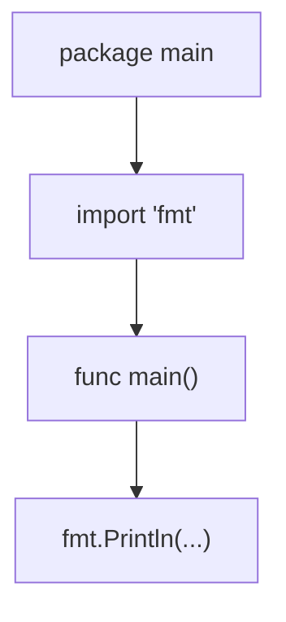

# GT.2 Hello World

## Mission

Learn the smallest useful shape of an executable Go program.

## Prerequisites

- `GT.1` installation verification

## Mental Model

Every Go file follows a simple, top-down hierarchy:
1. **Package Declaration**: Who am I?
2. **Imports**: What tools do I need from others?
3. **Definitions**: What can I do? (Functions, types, etc.)

## Visual Model



## Machine View

When you run this program, the Go runtime looks for a package named `main` and a function named `main`. This is the designated "entry point." If they are missing, the compiler will refuse to build an executable.

> [!NOTE]
> This "entry point" is required because of how the Go compiler translates source text into a running process, a concept introduced in [HC.2 Code to Execution](../../00-how-computers-work/02-code-to-execution/README.md).

## Run Instructions

```bash
go run ./01-getting-started/02-hello-world
```

## Code Walkthrough

- **`package main`**: Tells Go that this file is the entry point for an executable program, not just a library for others to use.
- **`import "fmt"`**: Pulls in the "format" package from the standard library so we can print text.
- **`func main() { ... }`**: This is where execution starts. When `main` finishes, the program exits.
- **`fmt.Println`**: A function call that takes "arguments" (the text you want to print) and sends them to standard output.

## Try It

1. Change the "Hello, World!" text and rerun the program.
2. Try adding multiple arguments to `fmt.Println("one", "two", "three")` and see how it handles spaces.
3. Remove the `package main` line and see what error `go run` produces.

## In Production

"Hello World" is the universal smoke test. If you can't get this to run, you can't build a distributed system. Even in advanced microservices, the first thing we often do when debugging a new environment is deploy a minimal "Hello" service to verify connectivity and deployment pipelines.

## Thinking Questions

1. Why does Go require a specific `main` package and function instead of just running any code it finds?
2. What happens if you have two files with `func main()` in the same directory?
3. Why do we need to import `fmt` instead of printing being built into the language itself (like `print` in Python)?

## Next Step

Next: `GT.3` -> [`01-getting-started/03-how-go-works`](../03-how-go-works/README.md)
