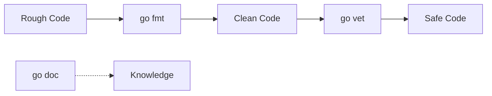

# GT.5 Go Tools: fmt, vet, and doc

## Mission

Master the three essential tools that keep Go code clean, safe, and documented.

## Prerequisites

- `GT.4` development environment

## Mental Model

Think of these tools as your **Automated Senior Engineer**.
- **`go fmt`**: Fixes your "handwriting" (style).
- **`go vet`**: Points out "spelling mistakes" in your logic.
- **`go doc`**: Explains the "dictionary" definitions of Go packages.

## Visual Model



## Machine View

- **`go fmt`**: Rewrites your source files to use tabs for indentation and standardized spacing.
- **`go vet`**: Uses static analysis to find common mistakes that the compiler might allow but are almost certainly bugs (like using the wrong format verb in `Printf`).
- **`go doc`**: Reads the comments in your code and formats them into a readable manual.

> [!NOTE]
> While `fmt`, `vet`, and `doc` cover formatting and logic checks, the "Proving" stage of the development loop relies on `go test`, which we explore in depth in [Section 08: Quality & Testing](../../08-quality-test/README.md).

> [!NOTE]
> These tools are accessed via the command line, building on the skills you developed in [HC.4 Terminal Confidence](../../00-how-computers-work/04-terminal-confidence/README.md).

## Run Instructions

```bash
go run ./01-getting-started/05-go-tools
```

## Code Walkthrough

- **`go fmt`**: We use this on every commit in this repo to keep it readable.
- **`go vet`**: This tool is part of the "Required Verification" standard for contributors.
- **`go doc`**: Try running `go doc fmt.Println` in your terminal to see it in action.

## Try It

1. Run `go doc fmt.Printf` in your terminal.
2. Intentionally use a wrong verb: `fmt.Printf("%d", "not a number")` and run `go vet`.
3. Observe how `go vet` catches the type mismatch even before you run the program.

## In Production

We never ship code that hasn't passed `go fmt` and `go vet`. In high-stakes engineering environments, "Vet" is often configured to fail the build if it finds even a minor suspicious pattern. This "fail-fast" approach is why Go systems are known for their stability.

## Thinking Questions

1. Why is it better to have the machine enforce style instead of human reviewers?
2. Can `go vet` catch every possible bug? Why or why not?
3. How does `go doc` encourage developers to write better comments?

## Next Step

Next: `GT.6` -> [`01-getting-started/06-reading-compiler-errors`](../06-reading-compiler-errors/README.md)
