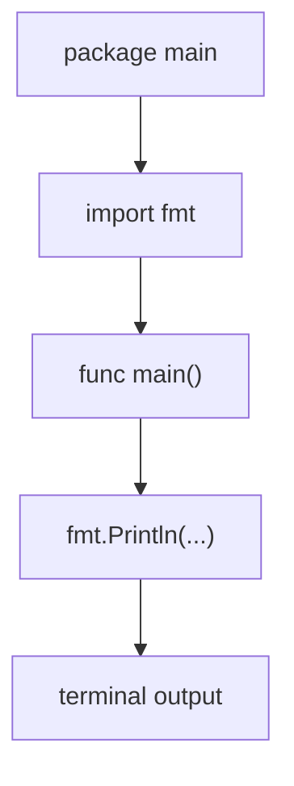

# GT.2 Hello World

## Mission

Learn the smallest useful shape of an executable Go program.

## Prerequisites

- `GT.1` installation verification

## Mental Model

A minimal Go executable has a stable shape:

1. Declare the package.
2. Import what the file needs.
3. Define `main`.
4. Execute statements inside `main`.

That shape repeats across the whole curriculum.

## Visual Model



## Machine View

When you run this lesson, the Go toolchain compiles the source file first. Execution then begins at `main`, and `fmt.Println` writes bytes to standard output for the terminal to display.

## Run Instructions

```bash
go run ./01-getting-started/2-hello-world
```

## Code Walkthrough

### `package main`

This marks the file as part of a runnable program instead of a reusable library package.

### `import "fmt"`

Printing lives in the `fmt` package, so the file must import it explicitly.

### `func main()`

`main` is the program entry point. Executable Go programs start there.

### `fmt.Println(...)`

`Println` prints one or more values and ends the line with a newline character.

### `fmt.Printf(...)`

`Printf` formats values into a template. It is an early preview that output can be shaped, not only dumped.

## Try It

1. Change the welcome message and rerun the program.
2. Change the year value and inspect the formatted output.
3. Add one more `fmt.Println(...)` call below the existing lines.

## In Production
Almost every service, CLI, job, and test binary still starts with this same shape: executable package, imports, entry point, side effects. The files get bigger, but the contract does not change.

## Thinking Questions
1. Why does Go make `package main` and `func main()` explicit instead of assuming them?
2. What would break if the file tried to print without importing `fmt`?
3. Why might a language prefer a very small executable shape for beginners?

## Next Step

Next: `GT.3` -> `01-getting-started/3-how-go-works`

Open `01-getting-started/3-how-go-works/README.md` to continue.
