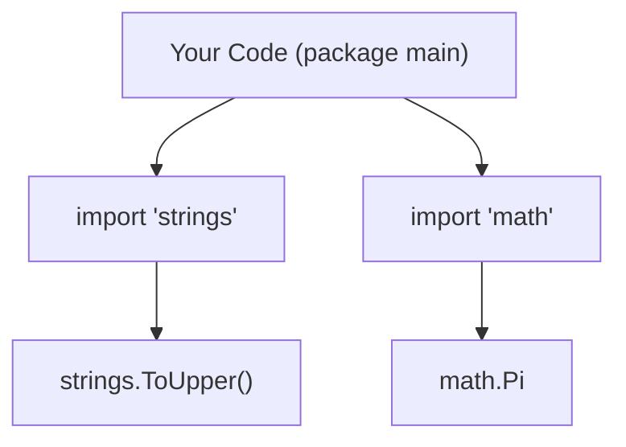

# GT.3 How Go Works

## Mission

Build a beginner-safe mental model for packages, imports, exported names, and the `go run` workflow.

## Prerequisites

- `GT.2` hello world

## Mental Model

Think of a package like a **toolbox**.
- The `fmt` toolbox contains tools for printing.
- The `math` toolbox contains tools for calculations.
- The `strings` toolbox contains tools for text manipulation.

If you want to use a tool from a different box, you must **import** that box.

## Visual Model



## Machine View

Go uses a strict visibility rule: **Capitalization**.
- If a name starts with an UpperCase letter (like `Println` or `Pi`), it is **Exported** (public).
- If it starts with a lowercase letter, it is **Internal** (private).
The compiler enforces this. You cannot use a private function from another package.

> [!NOTE]
> This simple rule - capitalization - is the foundation for package design in Go. You will see how this enables clear module boundaries in [MP.1 Module Basics](../../05-packages-io/01-modules-and-packages/1-module-basics/README.md).

> [!TIP]
> While we use strings and numbers here, Go allows you to create your own complex types, which we dive into during [Section 04: Types and Design](../../04-types-design/README.md).

## Run Instructions

```bash
go run ./01-getting-started/3-how-go-works
```

## Code Walkthrough

- **`import (...)`**: Notice the parentheses. This allows you to import multiple packages at once without repeating the `import` keyword.
- **`strings.ToUpper(greeting)`**: We call the `ToUpper` function *inside* the `strings` package.
- **`math.Pi`**: This is a constant value exported by the `math` package. Note there are no parentheses because it's a value, not a function.
- **`fmt.Printf`**: The `f` stands for "formatted." It allows us to control how numbers are displayed (like `%.2f` for two decimal places).

## Try It

1. Try to call `strings.toUpper(greeting)` (lowercase 't') and see the compiler error.
2. Add the `time` package to your imports and use `time.Now()` to print the current time.
3. Use `math.Max(5, 10)` to find the larger of two numbers and print the result.

## In Production

Go's strict export rules are a major engineering feature. They allow package authors to change internal code (lowercase functions) without breaking the code of people who use their package. Only the Capitalized names are part of the "Public API."

## Thinking Questions

1. Why does Go use capitalization for visibility instead of keywords like `public` or `private`?
2. What happens if you import a package but never use it? (Try it!)
3. Why are packages useful for organizing large codebases?

## Next Step

Next: `GT.4` -> [`01-getting-started/4-dev-environment`](../4-dev-environment/README.md)
