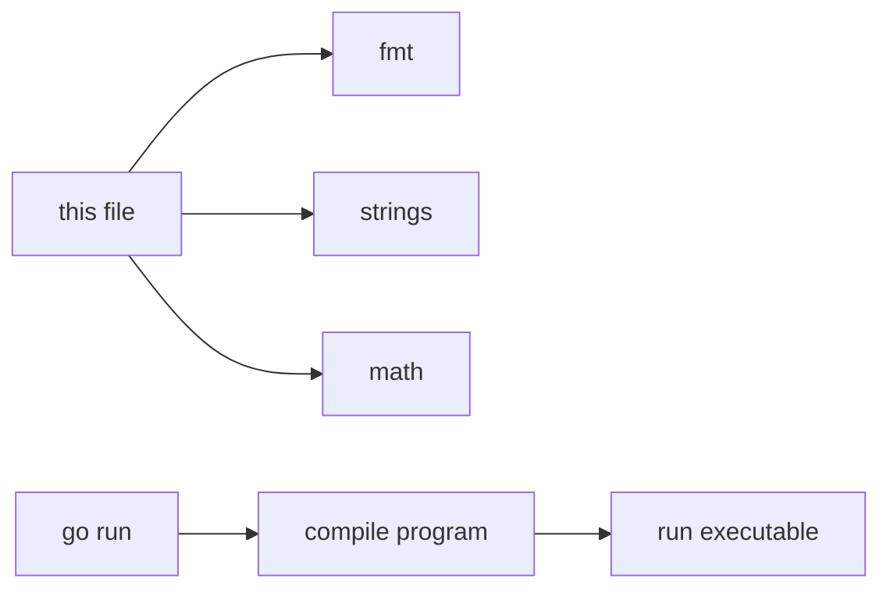

# GT.3 How Go Works

## Mission

Build a beginner-safe mental model for packages, imports, exported names, and the `go run` workflow.

## Prerequisites

- `GT.2` hello world

## Mental Model

Go organizes code into packages. A file imports packages when it wants to use capabilities it does not define itself.

This lesson uses several packages to show that one program can combine:

- printing
- text processing
- math helpers

## Visual Model



## Machine View

The Go toolchain resolves imports and type-checks package calls before execution begins. Only after compilation succeeds does the binary start at `main` and call into imported package code.

## Run Instructions

```bash
go run ./01-getting-started/3-how-go-works
```

## Code Walkthrough

### `import ("fmt" "math" "strings")`

This file depends on three different standard-library packages, each responsible for a different kind of work.

### `strings.ToUpper(...)`

This shows how package functions transform data without printing directly.

### `strings.Split(...)`

This turns one string into multiple pieces, which previews that package code can reshape data structures.

### `math.Pi`, `math.Sqrt(...)`, and `math.Pow(...)`

These lines show that packages can export both values and functions.

### Exported names

`ToUpper` and `Sqrt` begin with uppercase letters because Go uses capitalization to mark names that other packages may access.

## Try It

1. Change the `greeting` value and rerun the lesson.
2. Replace `math.Sqrt(144)` with another value and inspect the result.
3. Add one more call from the `strings` package.

## In Production
Real Go systems are mostly package boundaries. Teams rely on imports, exported names, and clear package ownership to keep codebases understandable and deployable.

## Thinking Questions
1. Why might Go prefer explicit package ownership at the call site?
2. What does the capital letter rule communicate to the reader?
3. Why is it useful that import resolution happens before the program starts running?

## Next Step

Next: `GT.4` -> `01-getting-started/4-dev-environment`

Open `01-getting-started/4-dev-environment/README.md` to continue.
