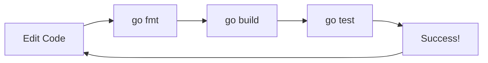

# GT.4 Development Environment

## Mission

Learn the small command loop that makes day-to-day Go work predictable.

## Prerequisites

- `GT.3` how Go works

## Mental Model

The Go toolchain is a **workflow**, not a single command.
Think of it like a craft:
1. **Write**: The act of typing code.
2. **Format**: `go fmt` makes it professional and readable.
3. **Check**: `go build` or `go vet` verifies the logic.
4. **Prove**: `go test` ensures it actually works.

## Visual Model



## Machine View

When you run `go build`, the compiler checks every file in the package. If it finds an error, it stops immediately. Unlike some other languages, Go refuses to produce a "broken" binary. This strictness is what makes Go software so reliable in production.

> [!NOTE]
> The resulting binary is the physical manifestation of the instruction list concept you learned in [HC.1 What is a Program?](../../00-how-computers-work/1-what-is-a-program/README.md).

## Run Instructions

```bash
go run ./01-getting-started/4-dev-environment
```

## Code Walkthrough

- **`exec.LookPath`**: This code actually checks your computer's `PATH` to see if essential Go tools are installed.
- **`gofmt`**: The tool that actually does the formatting.
- **`gopls`**: The "Go Language Server" that powers your editor's autocomplete and error highlighting.

## Try It

1. Purposely add some messy indentation to your `main.go`.
2. Run `go fmt ./01-getting-started/4-dev-environment/main.go`.
3. Observe how the file was instantly "cleaned up" to match the standard Go style.

## In Production

In a professional environment, we use **CI (Continuous Integration)** to run these commands automatically. If a developer forgets to format their code or breaks a test, the CI system rejects the change before it reaches the main branch.

## Thinking Questions

1. Why does Go have one official formatting style instead of letting developers choose their own?
2. What is the difference between `go build` and `go run`?
3. Why is it important that your editor (using `gopls`) shows you errors *while* you are typing?

## Next Step

Next: `GT.5` -> [`01-getting-started/5-go-tools`](../5-go-tools/README.md)
