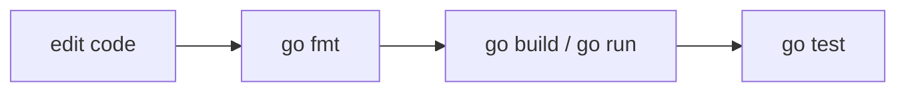

# GT.4 Development Environment

## Mission

Learn the small command loop that makes day-to-day Go work predictable.

## Prerequisites

- `GT.3` how Go works

## Mental Model

The Go toolchain is a workflow, not a single command:

1. Edit code.
2. Format it.
3. Build or run it.
4. Test it when tests exist.

That loop repeats across the entire repo.

## Visual Model



## Machine View

`go fmt` rewrites source files into Go's standard format. `go build` compiles packages. `go run` compiles and executes. `go test` builds test binaries and runs them. This lesson also asks the OS whether tools like `gopls` exist on the command path.

## Run Instructions

```bash
go run ./01-getting-started/4-dev-environment
```

## Code Walkthrough

### `commands := []commandInfo{ ... }`

The lesson stores the important Go commands as structured data so it can print them consistently.

### `for _, command := range commands { ... }`

This loop renders the command list without repeating the same formatting code over and over.

### `tools := []toolInfo{ ... }`

This second slice defines the development tools the lesson wants to probe for.

### `exec.LookPath(...)`

This asks the operating system whether a tool exists on the current `PATH`.

### `fmt.Println("NEXT UP: GT.5 go-tools")`

The footer marks the transition to the essential Go toolchain.

## Try It

1. Run `go fmt ./...` from the repo root.
2. Run `go build ./...` and notice that success is usually quiet.
3. Add a fake tool name to the list and inspect the "not found" branch.

## In Production
Reliable teams do not guess at their command loop. They use the same format-build-test rhythm locally, in CI, and in release pipelines so surprises show up early instead of late.

## Thinking Questions
1. Why does Go treat formatting as a command instead of a personal style choice?
2. What different problems do `go build` and `go test` solve?
3. Why is checking the `PATH` part of environment confidence?

## Next Step

Continue to `GT.5` go-tools.
