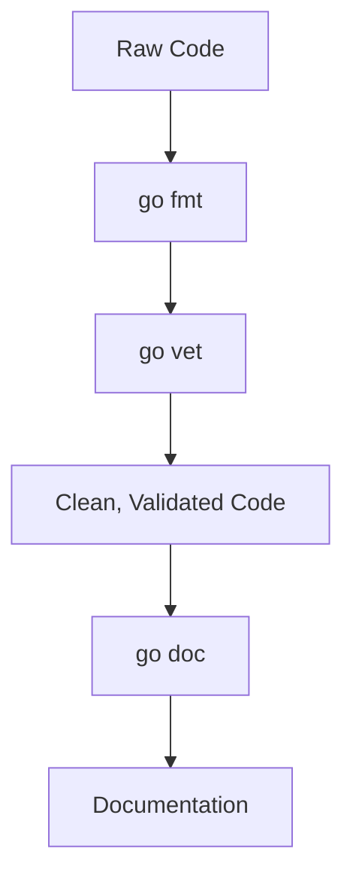

# GT.5 Go Tools

## Mission

Master the three essential tools that keep Go code clean, safe, and documented: `fmt`, `vet`, and `doc`.

## Why This Lesson Exists Now

Writing code is only half the job. Engineering is about maintaining that code. Go provides a standard toolchain so every developer on every team uses the same style, catches the same bugs early, and can read documentation without leaving the terminal.

## Prerequisites

- `GT.4` development environment

## Mental Model

Think of these tools as your "automated senior engineer":
1. `go fmt`: Fixes your style.
2. `go vet`: Catches suspicious logic.
3. `go doc`: Explains how things work.

## Visual Model



## Machine View

- `go fmt` parses your code into an Abstract Syntax Tree (AST) and prints it back out using standard rules.
- `go vet` uses static analysis to find patterns that are technically valid Go but almost certainly bugs (like printf format mismatches).
- `go doc` extracts comments from the source code to provide help text.

## Run Instructions

```bash
go run ./01-getting-started/5-go-tools
```

## Code Walkthrough

### `go fmt`

We use `go fmt ./...` to ensure all files in the current module follow the Go style guide.

### `go vet`

We use `go vet ./...` to run static analysis. It's often run automatically by editors and CI systems.

### `go doc`

You can run `go doc fmt.Println` to see documentation for any standard library function right in your terminal.

## Try It

1. Intentionally mess up the indentation of `main.go` and run `go fmt ./01-getting-started/5-go-tools/main.go`.
2. Add a `fmt.Printf("%d", "not a number")` to the code and run `go vet ./01-getting-started/5-go-tools`.
3. Run `go doc fmt.Printf` in your terminal.

## ⚠️ In Production

Never commit code that hasn't been through `go fmt`. Most teams enforce this in their CI/CD pipelines. Using `go vet` is also mandatory to catch common mistakes before they reach production.

## 🤔 Thinking Questions

1. Why does having a single standard format (`go fmt`) reduce "bikeshedding" in code reviews?
2. What kind of errors can `go vet` find that the compiler might miss?
3. Why is it useful to have documentation available in the terminal via `go doc`?

## Next Step

Continue to `GT.6` reading compiler errors.
