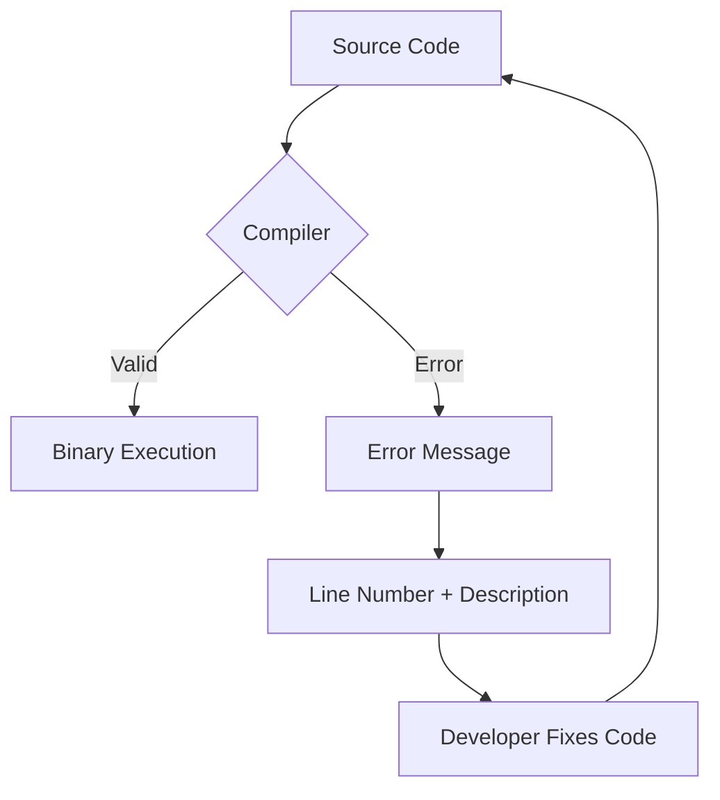

# GT.6 Reading Compiler Errors

## Mission

Learn to treat the compiler as a helpful partner instead of an obstacle by decoding its error messages.

## Why This Lesson Exists Now

Beginners often feel panic when they see red text. But Go's compiler is famously helpful. It doesn't just say "no"; it usually tells you exactly which line is broken and what it expected to find.

## Prerequisites

- `GT.5` go tools

## Mental Model

Think of the compiler as a "spell checker" for logic. It won't let you run a program that it knows will crash or behave unpredictably.

## Visual Model



## Machine View

The compiler goes through several phases: scanning (lexing), parsing, and type-checking. Most beginner errors happen during parsing (missing braces) or type-checking (using a string where an int was expected).

## Run Instructions

```bash
go run ./01-getting-started/6-reading-compiler-errors
```

## Code Walkthrough

In this lesson, we look at common error shapes:

1. `syntax error: unexpected ...`: You forgot a brace or semicolon.
2. `... declared and not used`: Go enforces clean code by rejecting unused variables.
3. `undefined: ...`: You are trying to use something that doesn't exist in this scope.

## Try It

1. Open `main.go` and remove a closing brace `}`. Run `go run .` and look at the error.
2. Declare a new variable `x := 10` but don't use it. Observe the compiler error.
3. Try to call a function that doesn't exist, like `fmt.Printlnz("hi")`.

## ⚠️ In Production

Reading compiler errors quickly is the difference between a 30-second fix and a 10-minute frustration. In production, CI systems will reject any code that doesn't compile, ensuring that "broken" code never reaches the user.

## 🤔 Thinking Questions

1. Why is a compiler error better than a runtime crash?
2. What does the "line number" in an error message actually represent?
3. Why does Go refuse to compile code with unused variables?

## Next Step

Continue to `LB.1` variables.
