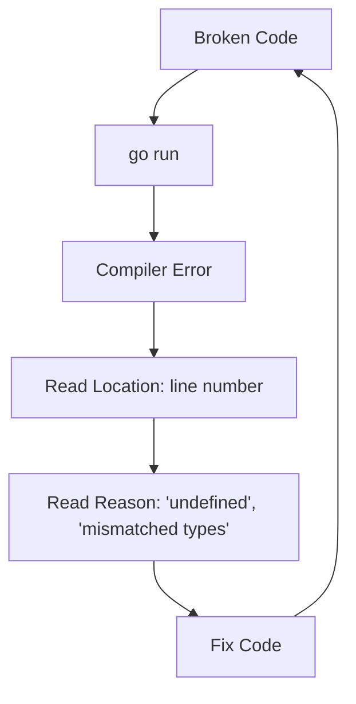

# GT.6 Reading Compiler Errors

## Mission

Learn to treat the compiler as a helpful partner instead of an obstacle by decoding its error messages.

## Prerequisites

- `GT.5` go tools

## Mental Model

Think of the compiler as a **Spell Checker for Logic**.
It applies the rules of the language consistently. If you break a rule, it stops you *before* broken code reaches a user.

## Visual Model



## Machine View

### Anatomy of an Error Message

Go error messages follow a standard format: `./main.go:32:9: undefined: x`

1. **`./main.go`**: The file where the error happened.
2. **`32`**: The line number.
3. **`9`**: The character column (position on the line).
4. **`undefined: x`**: The actual problem (the compiler doesn't know what `x` is).

## Run Instructions

```bash
go run ./01-getting-started/6-reading-compiler-errors
```

## Code Walkthrough

- **Strictness**: Go is a "statically typed" language. This means the compiler checks types *before* the program runs.
- **Unused Imports**: One common error for beginners is "imported and not used." Go refuses to compile if you have extra imports, keeping your binaries small and your code clean.

## Try It

1. In `main.go`, try to print a variable that doesn't exist: `fmt.Println(missingVariable)`.
2. Run the code and carefully read the error message. Does the line number match?
3. Try removing the `import "fmt"` while still calling `fmt.Println`. Read the "undefined: fmt" error.

## In Production

In large systems, we want many mistakes to fail at **Compile Time**, not **Runtime**. A compile-time error costs a few seconds of developer attention. A runtime error in production can create customer impact, data loss, or an incident. The compiler is the first line of defense.

## Thinking Questions

1. Why is a compiler error better than a program that runs but produces the wrong result?
2. What are the three most common errors you've seen so far?
3. How does the compiler help you "discover" how to use a new package?

> [!NOTE]
> These errors are generated during the "Type Checking" and "Parsing" stages of the compiler pipeline you learned in [HC.2 Code to Execution](../../00-how-computers-work/2-code-to-execution/README.md).

## Next Step

Next: `LB.1` -> [`02-language-basics/1-variables`](../../02-language-basics/1-variables/README.md)
