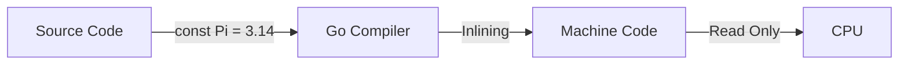

# LB.2 Constants

## Mission

Learn how Go represents values that should never change at runtime.

## Prerequisites

- `LB.1` variables

## Mental Model

A variable can change while the program runs. A constant cannot.
Constants communicate:
- This value is fixed by design.
- The compiler can treat it as static, compile-time data.

> [!NOTE]
> You already learned how variables hold mutable state in [LB.1 Variables](../01-variables/README.md). Constants provide the immutable counterpart.

## Visual Model



## Machine View

Go constants are "untyped" by default until they are used in a context that requires a type. This makes them highly flexible. At the machine level, they don't occupy a mutable memory slot that can be written to; they are often baked directly into the instruction stream (immediate values) by the compiler.

## Run Instructions

```bash
go run ./02-language-basics/02-constants
```

## Code Walkthrough

- **`const Host = "127.0.0.1"`**: A string constant.
- **`const ( ... )`**: Grouping constants makes it clear they are part of the same domain (e.g., server config).
- **`const pi float64 = 3.1415926`**: Explicitly typing a constant limits its flexibility but ensures it matches a specific data structure.

> [!TIP]
> Grouped constants are often used with the `iota` keyword to create incremental enumerations, which we explore in [LB.3 Enums](../03-enums/README.md).

## Try It

1. Change one constant value in `main.go` and rerun the lesson.
2. Add another constant inside the grouped `const` block.
3. Try to reassign a constant (e.g., `Host = "0.0.0.0"`) and read the compiler error.

## In Production

Constants are where teams encode stable facts: protocol values, configuration keys, fixed messages, and sentinel sizes. Making those values immutable prevents accidental runtime drift. If a value *must* change based on the environment (e.g., Development vs. Production), it should be a variable or loaded from configuration, not a constant.

## Thinking Questions

1. Why is "should never change" worth expressing in the type system?
2. How does inlining a constant (compiler level) differ from reading a variable from RAM?
3. What bugs become impossible to write when a value is a constant?

## Next Step

Next: `LB.3` -> [`02-language-basics/03-enums`](../03-enums/README.md)
