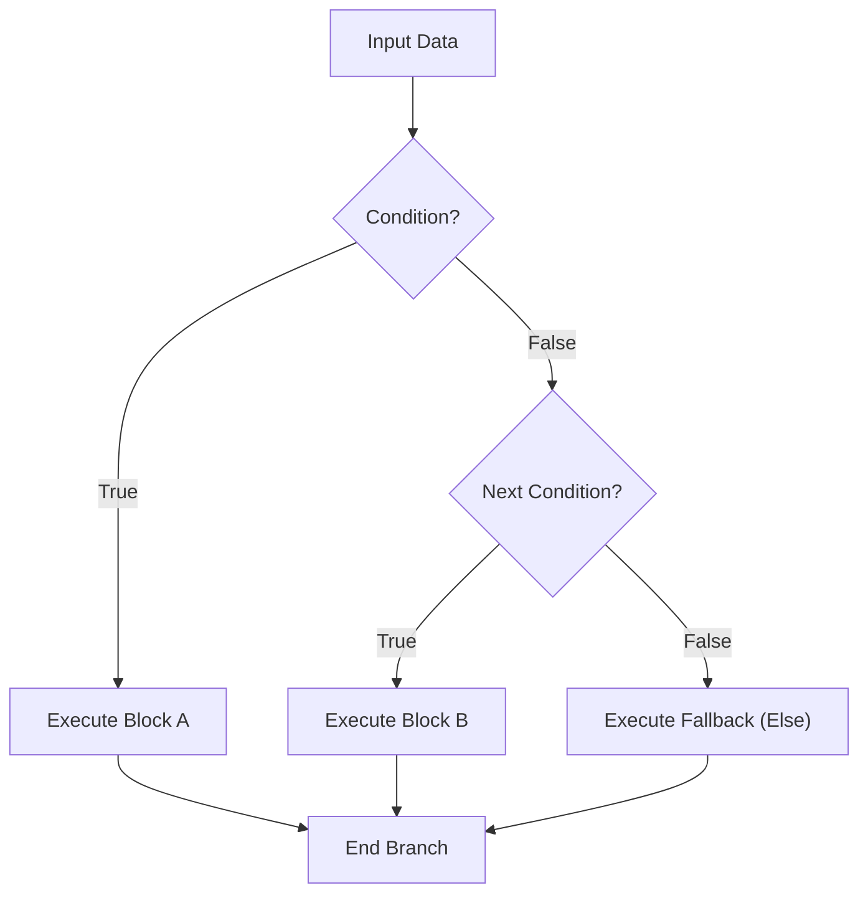

# CF.1 If / Else

## Mission

Learn how a Go program chooses one path or another based on a condition.

## Prerequisites

- `LB.4` application logger

## Mental Model

Branching is the ability to ask a question and choose a path based on the answer.
In Go, `if`, `else if`, and `else` allow you to define these paths:

1.  Evaluate a condition (must result in a `bool`).
2.  If `true`, execute the first block and skip the rest.
3.  If `false`, move to the next `else if` or fall back to `else`.

> [!NOTE]
> Branching relies entirely on boolean evaluations (`true` or `false`) which you learned about in [LB.1 Variables](../../01-variables/README.md).

## Visual Model



## Machine View

At the machine level, an `if` statement results in a "jump" or "branch" instruction. The CPU evaluates the condition; if it meets the criteria, execution jumps to a specific memory address containing the branch code. Otherwise, it continues to the next instruction (the fallback).

## Run Instructions

```bash
go run ./02-language-basics/03-control-flow/01-if-else
```

## Code Walkthrough

-   **`if temp > 30`**: Checks a numeric condition. Notice the lack of parentheses `()`—they are not used in Go unless required for operator precedence.
-   **`else if score >= 80`**: Chains a second check. Only one block in an `if/else` chain will ever execute.
-   **`else`**: The final fallback if no other conditions were met.
-   **`{ }`**: Braces are mandatory in Go, even for single-line blocks. This prevents the "dangling else" bug common in other languages.

> [!TIP]
> While `if/else` is perfect for binary or small chains, handling a single variable with many possible discrete values is often cleaner with a `switch` statement, which we cover in [CF.4 Switch](../04-switch/README.md).

## Try It

1.  In `main.go`, change `temperature` to `35` and rerun.
2.  Change `score` to `75` and see which grade is printed.
3.  Add a new `else if` check to the score logic.

## In Production

Branching is the heart of business logic. It handles input validation, feature flags, authorization checks, and error recovery. In production systems, keeping these branches shallow (avoiding deep nesting) is key to maintainability.

## Thinking Questions

1.  Why does Go require curly braces `{}` even for one-line branches?
2.  Why is "only one branch runs" critical for understanding performance?
3.  What happens if you have an `if` without an `else`?

## Next Step

Next: `CF.2` -> [`02-language-basics/03-control-flow/02-for-basics`](../02-for-basics/README.md)
