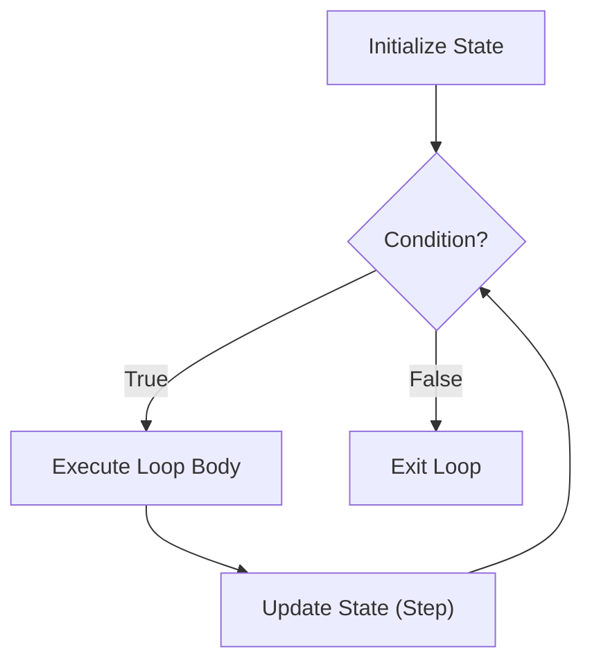

# CF.2 For Basics

## Mission

Learn how Go repeats work with its single loop keyword: `for`.

## Prerequisites

- `CF.1` if / else

## Mental Model

A loop says: "Continue executing this block of code while the condition remains true."

Go simplifies iteration by having exactly **one** keyword—`for`—which handles all looping scenarios:
- **Counted Loops**: Traditional `for (i=0; i<10; i++)` style.
- **Condition-only Loops**: Behaves like `while` in other languages.
- **Collection Loops**: Iterating over lists using the `range` keyword.

> [!NOTE]
> In [CF.1 If / Else](../01-if-else/README.md), you learned to use conditions to choose a path. The `for` loop uses those exact same conditions to decide whether to *repeat* a path.

## Visual Model



## Machine View

At the machine level, a `for` loop is a combination of a comparison instruction and a backward jump.
1. The CPU compares a value (the condition).
2. If it evaluates to true, it executes the body.
3. At the end of the body, it performs a "jump" back to the comparison instruction.
This cycle continues until the comparison fails.

## Run Instructions

```bash
go run ./02-language-basics/03-control-flow/02-for-basics
```

## Code Walkthrough

- **Counted Loop**: `for i := 1; i <= 5; i++`
  - `i := 1`: Initialization (happens once).
  - `i <= 5`: Condition (checked before every iteration).
  - `i++`: Post-step (happens after every iteration).
- **Condition-only Loop**: `for countdown > 0`
  - Acts like a `while` loop. The loop continues as long as `countdown` is positive.
- **Range Preview**: `for _, word := range words`
  - A safer, cleaner way to visit every item in a list without managing indexes manually.

> [!TIP]
> We use the `range` keyword briefly here, but we will explore it in depth when we master [DS.2 Slices](../../04-data-structures/02-slices/README.md).

## Try It

1. In `main.go`, change the counted loop to run from `1` to `10`.
2. Modify the `countdown` start value to `5`.
3. Add your own name to the `words` slice and rerun the program.

## In Production

Loops are the workhorses of production systems. They process batch jobs, stream data from databases, and manage retries for failed network calls. Efficient loops (avoiding unnecessary allocations or infinite cycles) are critical for system stability.

## Thinking Questions

1. Why does Go use only one `for` keyword instead of separate `while` or `do-while` keywords?
2. What happens if a loop's condition is false before the first iteration starts?
3. What is a "busy loop" and why should you avoid it in production?

## Next Step

Next: `CF.3` -> [`02-language-basics/03-control-flow/03-break-continue`](../03-break-continue/README.md)
