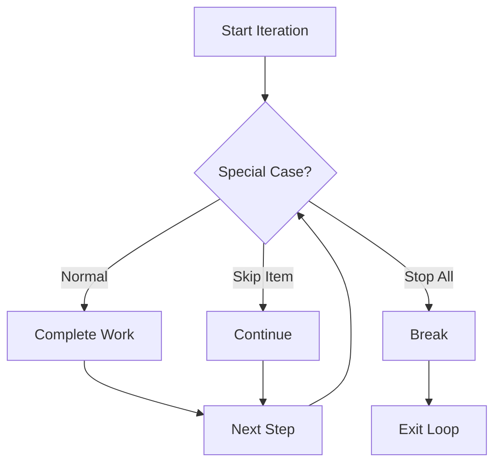

# CF.3 Break / Continue

## Mission

Learn how to change a loop's behavior after the loop has already started.

## Prerequisites

- `CF.2` for basics

## Mental Model

Loop control gives you two important precision tools for managing iteration:

-   **`continue`**: "I'm done with this specific item. Skip the rest of this block and move to the next iteration."
-   **`break`**: "I'm done with this entire loop. Exit immediately and continue with the rest of the program."

These tools let you handle exceptions or early successes without cluttering the main loop condition.

> [!NOTE]
> In [CF.2 For Basics](../02-for-basics/README.md), you learned how to start and stop a loop based on the `for` condition. `break` and `continue` allow you to intervene from *inside* the loop body based on dynamic state.

## Visual Model



## Machine View

-   **`continue`**: Performs a "jump" to the loop's post-iteration step (e.g., `i++`) and then to the condition check.
-   **`break`**: Performs a "jump" to the first instruction *after* the loop's scope.
Both of these bypass the remaining instructions in the current loop body.

## Run Instructions

```bash
go run ./02-language-basics/03-control-flow/03-break-continue
```

## Code Walkthrough

-   **`if i%2 == 0 { continue }`**: Skips even numbers. The `fmt.Println` below it will never run for even `i`.
-   **`if i == 7 { break }`**: Terminates the loop once `i` hits `7`. No numbers after `7` will ever be checked or printed.
-   **Placement Matters**: If you put the `fmt.Println` *before* the `break` check, `7` would be printed before the loop stops.

> [!TIP]
> We used `if` statements to decide when to break or continue. Next, we will learn how `switch` can replace multiple `if/else` checks for cleaner discrete branching in [CF.4 Switch](../04-switch/README.md).

## Try It

1.  In `main.go`, move the `break` check before the `continue` check. How does the output change?
2.  Change the stop value from `7` to `9`.
3.  Modify the logic to only print multiples of 3.

## In Production

Search algorithms, data filters, and retry loops depend heavily on `break` and `continue`.
-   **Break**: Exit a search as soon as the item is found (saves CPU).
-   **Continue**: Skip malformed records in a batch process without crashing the whole job.

## Thinking Questions

1.  When would `break` be the wrong tool if you only want to skip one "bad" piece of data?
2.  Why does the order of checks inside the loop body affect the outcome?
3.  How can `break` help prevent "infinite loops" in complex logic?

## Next Step

Next: `CF.4` -> [`02-language-basics/03-control-flow/04-switch`](../04-switch/README.md)
