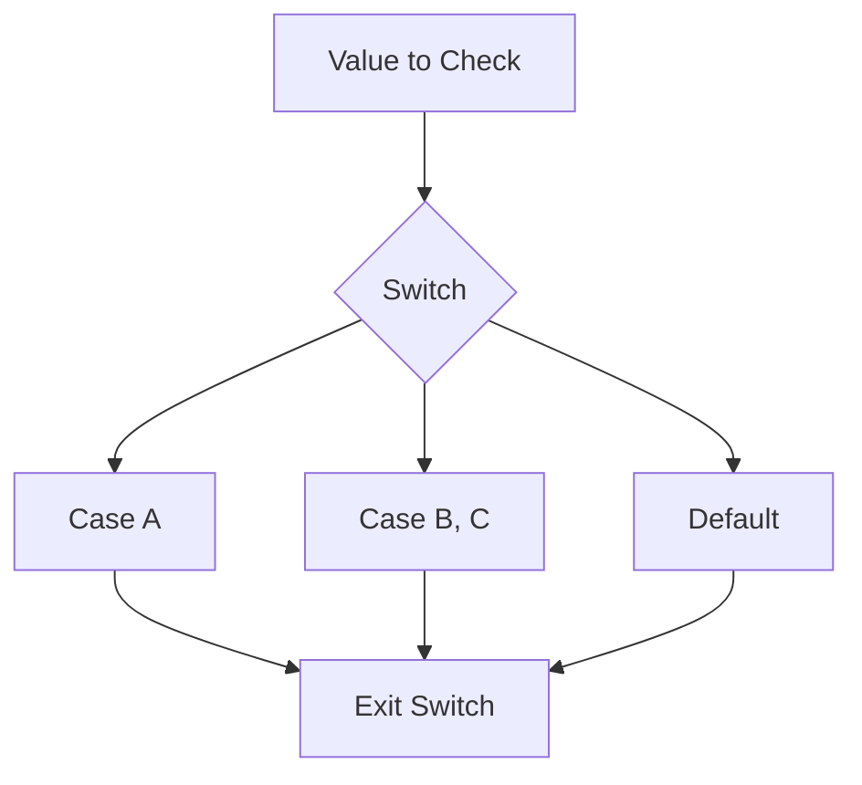

# CF.4 Switch

## Mission

Learn how to choose among several possible paths without building long, hard-to-scan branch chains.

## Prerequisites

- `CF.1` if / else
- `CF.2` for basics

## Mental Model

`switch` is a multi-way branch. It is a more readable alternative to a long list of `else if` statements when you are comparing one variable against several known values.

In Go, `switch` is superior because it **implicitly breaks**. Once a case matches and executes, the program exits the switch block. This prevents "fallthrough" bugs where the program accidentally executes multiple branches.

> [!NOTE]
> In [CF.3 Break / Continue](../03-break-continue/README.md), you learned how to manually interrupt flow. `switch` provides a structured way to handle these interruptions automatically.

## Visual Model



## Machine View

The compiler often implements a `switch` statement using a "jump table" (for dense integer cases) or a binary search (for sparse cases). This is often more efficient than a linear chain of `if/else` checks because the CPU can jump directly to the matching code path in fewer steps.

## Run Instructions

```bash
go run ./02-language-basics/03-control-flow/04-switch
```

## Code Walkthrough

-   **`switch day { ... }`**: The "tagged" form. It compares the variable `day` against each `case`.
-   **`case "Saturday", "Sunday":`**: You can group multiple values into one case if they share the same outcome.
-   **`switch { ... }`**: The "tagless" form. It acts like a clean `if/else` ladder where each `case` is a separate boolean condition.
-   **`default`**: Runs only if no other cases match. It is the "else" of the switch world.

> [!TIP]
> While `switch` simplifies synchronous branching, Go provides a unique tool called `defer` to handle cleanup logic that must run at the end of a scope regardless of which branch was taken. We cover this in [CF.5 Defer Basics](../05-defer-basics/README.md).

## Try It

1.  In `main.go`, change `day` to "Saturday" and rerun.
2.  In the tagless `switch`, change `score` to `65`.
3.  Add a new case to the `day` switch for "Friday" that prints "Almost weekend!".

## In Production

`switch` is the standard tool for state machines, command routers (e.g., handling different CLI flags), and message type handlers. Its tabular layout makes it much easier for a teammate to audit the different states a system can be in.

## Thinking Questions

1.  When is `switch` clearer than an `if / else if` ladder?
2.  Why is Go's "no fallthrough by default" behavior safer for beginners?
3.  What is the main difference between a tagged `switch` and a tagless `switch`?

## Next Step

Next: `CF.5` -> [`02-language-basics/03-control-flow/05-defer-basics`](../05-defer-basics/README.md)
