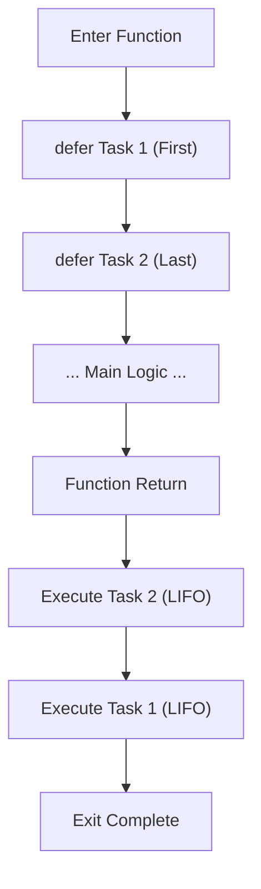

# CF.5 Defer Basics

## Mission

Learn how to schedule work to happen at the very end of a function, ensuring cleanup always runs.

## Prerequisites

- `CF.4` switch

## Mental Model

Think of `defer` like a "sticky note" you put on the exit door of a room. No matter what you do inside the room or which door you use to leave, you **must** perform the task on the note before you walk out.

`defer` allows you to write cleanup code (like "close the door") immediately after the setup code (like "open the door"), keeping them visually grouped even though they execute at opposite ends of the function's lifecycle.

> [!NOTE]
> In [CF.1 If / Else](../01-if-else/README.md) and [CF.4 Switch](../04-switch/README.md), control flow executed exactly where the statement was placed. `defer` breaks this by separating *where* the statement is written from *when* it executes.

## Visual Model



## Machine View

`defer` pushes a function call onto a **Stack**.
- When the surrounding function reaches its return statement, it pops these calls off the stack one by one.
- Because it is a stack, the most recently deferred task runs first (**Last-In, First-Out**).
- This ensures that if you open a database and then open a file, the file is closed before the database is closed (unwinding the dependency).

## Run Instructions

```bash
go run ./02-language-basics/03-control-flow/05-defer-basics
```

## Code Walkthrough

-   **`defer fmt.Println(...)`**: Schedules a print to run at the very end.
-   **Multiple Defers**: They run in reverse order (LIFO).
-   **Execution Scope**: `defer` runs when the *function* returns, not when a block (like an `if` or `for` loop) ends.

> [!TIP]
> While this lesson focuses on mechanics, we will apply `defer` to real-world resource management (like closing files) in [CF.6 Defer Use Cases](../06-defer-use-cases/README.md).

## Try It

1.  In `main.go`, add a third `defer` statement and observe the order of execution.
2.  Add a `fmt.Println` after the `defer` calls but before the end of `main()`. Which prints first?
3.  Add a `defer` inside a conditional block that doesn't run. Does the task still execute?

## In Production

`defer` is a cornerstone of Go's reliability. It is used to release database connections, close network sockets, unlock mutexes, and flush buffers. It eliminates the risk of "resource leaks" that happen when a developer adds a new `return` statement but forgets to copy-paste the cleanup code.

## Thinking Questions

1.  Why is Last-In-First-Out (LIFO) the safest order for resource cleanup?
2.  What would happen if `defer` ran when a *block* ended instead of when the *function* ended?
3.  Why is `defer` better than manually calling cleanup at every `return` point?

## Next Step

Next: `CF.6` -> [`02-language-basics/03-control-flow/06-defer-use-cases`](../06-defer-use-cases/README.md)
