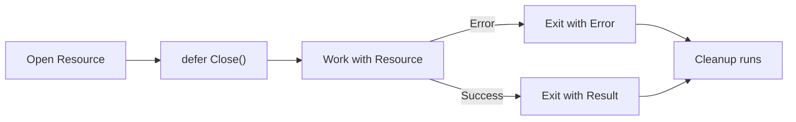

# CF.6 Defer Use Cases

## Mission

See how `defer` is used in production for file cleanup, resource management, and state protection.

## Prerequisites

- `CF.5` defer basics

## Mental Model

Think of `defer` as a **"Safety Harness"**. Before you start a potentially hazardous task (like opening a file or locking a database record), you put on the harness (`defer resource.Close()`). No matter how the task ends—whether you finish successfully or slip on an error—the harness is there to catch you and ensure the resource is closed safely.

Go idiomatic code uses **Pair Patterns**:
- `Open` -> `defer Close`
- `Lock` -> `defer Unlock`
- `Begin` -> `defer Rollback` (unless committed)

## Visual Model



## Machine View

When you `defer` a call like `file.Close()`, Go captures the necessary parameters at that moment. Even if the `file` variable is later reassigned (though you shouldn't), the deferred call will execute on the correct resource. The machine ensures that the deferred stack is processed even if the function exits via a `return` or a `panic` (unrecoverable error).

> [!NOTE]
> In [CF.5 Defer Basics](../05-defer-basics/README.md), you learned the LIFO (Last-In, First-Out) execution order. This is critical in production when you have dependencies (e.g., closing a file *before* closing the disk connection).

## Run Instructions

```bash
go run ./02-language-basics/03-control-flow/06-defer-use-cases
```

## Code Walkthrough

- **Immediate Defer**: Notice how `defer` is placed immediately after the "Open" operation succeeds. This is the gold standard for Go resource management.
- **Early Returns**: If your function had 10 different `if err != nil { return }` checks, `defer` ensures you don't have to copy-paste the `Close()` call 10 times.

> [!TIP]
> You have mastered the individual components of Go's control flow. Now, combine branching, looping, switching, and defer into one unified business logic exercise in [CF.7 Pricing Checkout](../07-pricing-checkout/README.md).

## Try It

1. In `main.go`, add a simulated "Database Connection" that uses `defer` to close.
2. Observe how the LIFO order handles closing the "File" and the "Database" in the correct reverse sequence.
3. Try adding a `return` statement in the middle of `simulateFileOperation`. Does the file still close?

## In Production

Resource leaks (unclosed files, network sockets, or database handles) are one of the most common causes of production memory exhaustion and system crashes. `defer` is not just a convenience; it is the primary mechanism for writing reliable, production-grade Go software.

## Thinking Questions

1. Why is it better to `defer` cleanup immediately rather than at the end of the function?
2. What happens to resources if you *don't* use `defer` and your code returns early due to an error?
3. How does `defer` improve code readability during peer reviews?

## Next Step

Next: `CF.7` -> [`02-language-basics/03-control-flow/07-pricing-checkout`](../07-pricing-checkout/README.md)
