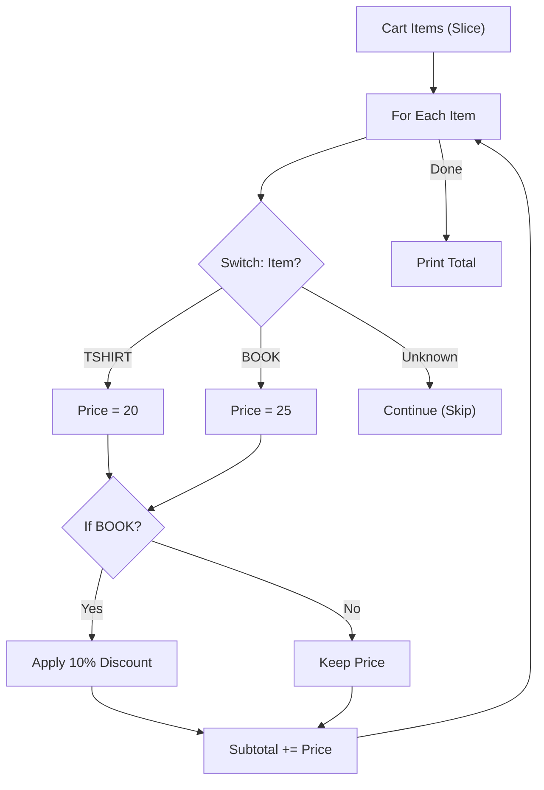

# CF.7 Pricing Checkout

## Mission

Build a small checkout flow that combines branching, loops, `switch`, and `continue` into one runnable program.

## Prerequisites

- `CF.1` through `CF.6`

## Mental Model

This milestone acts as a miniature "Rule Engine". You will process a stream of data and apply different logic based on what you find:

1.  **Loop**: Iterate over each item in the cart.
2.  **Classify**: Use a `switch` to identify the item and its base price.
3.  **Filter**: Use `if` and `continue` to skip invalid or unknown items.
4.  **Modify**: Use `if` to apply conditional discounts (e.g., 10% off books).
5.  **Accumulate**: Update a running subtotal.

This proves that Go's control flow constructs compose together naturally to solve real business problems.

> [!NOTE]
> This final Control Flow milestone combines the looping from [CF.2 For Basics](../02-for-basics/README.md), the value matching from [CF.4 Switch](../04-switch/README.md), and the loop intervention from [CF.3 Break / Continue](../03-break-continue/README.md).

## Visual Model



## Machine View

The program carries a single piece of state—the `subtotal`—across many iterations. Each iteration performs a series of checks and jumps, eventually updating the subtotal in RAM. The loop effectively "reduces" a list of items into a single numeric value.

## Run Instructions

```bash
go run ./02-language-basics/03-control-flow/07-pricing-checkout
```

## Solution Walkthrough

-   **`for _, item := range cart`**: Visits every item code in the slice.
-   **`switch item { ... }`**: Assigns the starting price. Notice that if an item isn't in the switch, `price` remains `0`.
-   **`if price == 0 { continue }`**: This guard clause ensures that unknown items don't affect the subtotal.
-   **`if item == "BOOK" { ... }`**: An extra business rule that only applies to a specific category.
-   **`subtotal += price`**: The final step of the loop, ensuring the item is paid for.

> [!TIP]
> You have been using "Slices" (like `[]string{...}`) throughout this track. Now, go deep into how these collections actually work in memory in [DS.1 Arrays](../../04-data-structures/01-array/README.md).

## Try It

1.  Add a new item "HAT" with a price of `15.00` to the `switch` block in `main.go`.
2.  Change the book discount from `0.90` (10% off) to `0.80` (20% off).
3.  Add an unknown string like "GHOST" to the `cart` slice and verify that the program skips it safely.

## Verification Surface

Run the program:
```bash
go run ./02-language-basics/03-control-flow/07-pricing-checkout
```

Expected output:
```text
Processing checkout:
TSHIRT: 20.00
MUG: 12.50
HAT: 18.00
BOOK promo: 25.99 -> 23.39
skip KEYBOARD: unknown item
subtotal: 73.89
```

## In Production

In real-world billing or e-commerce systems, this logic is often separated into "Rule Engines". However, the core remains the same: a loop that evaluates conditions and mutates state. Reliability here is paramount—a bug in a loop condition could result in overcharging thousands of customers.

## Thinking Questions

1.  Why is `continue` a better fit than `break` when an unknown item is found?
2.  Why does the discount rule belong in an `if` statement after the `switch`?
3.  How does the "Zero Value" of the `price` variable (0.0) help us detect unknown items?

## Next Step

Next: `DS.1` -> [`02-language-basics/04-data-structures/01-array`](../../04-data-structures/01-array/README.md)
