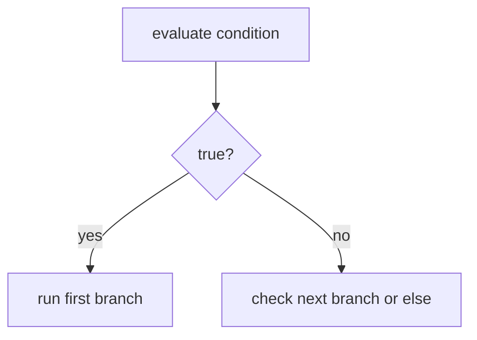

# CF.1 If / Else

## Mission

Learn how a Go program chooses one path or another based on a condition.

## Prerequisites

- `LB.4` application logger

## Mental Model

Branching is the ability to ask a question and choose a path.

With `if`, `else if`, and `else`:

- one condition is checked
- one branch runs
- the other branches are skipped

> **Backward Reference:** In the previous section, you learned about evaluating boolean state like `true` and `false` in [Lesson 1: Variables](../../1-variables/README.md). Branching relies entirely on boolean evaluations to choose a path.

## Visual Model



## Machine View

The program evaluates the condition expression to a boolean value. Based on that result, execution jumps into one branch block and skips the others.

## Run Instructions

```bash
go run ./02-language-basics/03-control-flow/1-if-else
```

## Code Walkthrough

### `if temperature > 30 { ... } else { ... }`

This is the simplest branch shape: one true path and one fallback path.

### `if score >= 90`, `else if score >= 80`, `else`

This chain checks conditions in order until one matches.

### `if username == "" { ... }`

Branching is not only for numbers. Programs also branch on text, flags, and missing state.

### Only one branch runs

Even when several branches exist, the program executes only the first matching branch.

> **Forward Reference:** We will soon learn about the `switch` statement in [Lesson 4: Switch](../4-switch/README.md), which offers an even cleaner way to handle branching when you need to check a single variable against many possible discrete values.

## Try It

1. Change the temperature so the first branch flips.
2. Change the score so a different grade branch runs.
3. Set `username` to your own name and inspect the final output.

## In Production
Branching is how services validate input, enforce authorization, choose business rules, and decide how to handle failures. Clean branch logic makes systems easier to trust.

## Thinking Questions
1. Why is "only one branch runs" an important mental model?
2. When is an `else if` chain clearer than nested `if` blocks?
3. What kinds of real-world state besides numbers can drive branching?

## Next Step

Next: `CF.2` -> `02-language-basics/03-control-flow/2-for-basics`

Open `02-language-basics/03-control-flow/2-for-basics/README.md` to continue.
