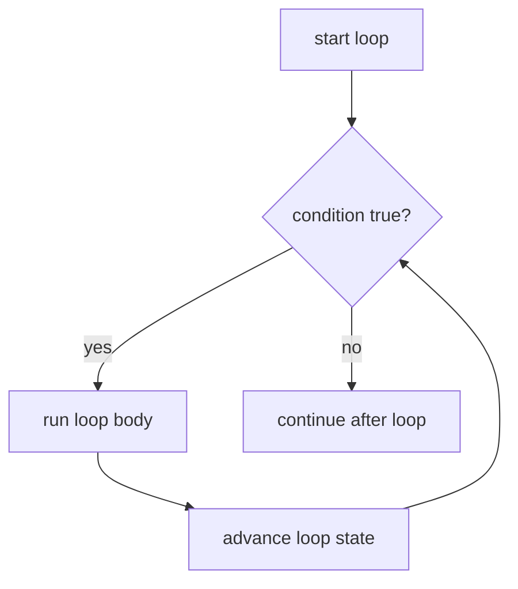

# CF.2 For Basics

## Mission

Learn how Go repeats work with its single loop keyword: `for`.

## Prerequisites

- `CF.1` if / else

## Mental Model

A loop says, "keep doing this work while the rule allows it."

Go uses one keyword for several loop shapes:

- counted loops
- condition-only loops
- `range` loops over collections

> **Backward Reference:** In [Lesson 1: If / Else](../1-if-else/README.md), you learned how to evaluate boolean conditions to choose a path. The `for` loop uses those exact same boolean conditions to decide whether to *keep going* on a path.

## Visual Model



## Machine View

A classic `for` loop has three moving parts: initialization, condition check, and post-step. The condition is checked before each new iteration, and the loop stops when that condition becomes false.

## Run Instructions

```bash
go run ./02-language-basics/03-control-flow/2-for-basics
```

## Code Walkthrough

### `for i := 1; i <= 5; i++ { ... }`

This is the counted-loop form: start value, condition, and step.

### `for countdown > 0 { ... }`

This condition-only loop behaves like a traditional `while` loop in other languages.

### `for _, word := range words { ... }`

This previews how `range` visits values inside a collection one by one.

### Loop body

The same code block can run zero times, once, or many times depending on the condition.

> **Forward Reference:** We use the `range` loop briefly here, but we will study it deeply when we learn about slices and arrays in [Lesson 4: Data Structures](../../04-data-structures/1-array/README.md).

## Try It

1. Change the counted loop to stop earlier.
2. Increase the countdown start value.
3. Add another word to the `range` example.

## In Production
Loops are everywhere in real systems: processing requests, scanning files, walking query results, aggregating metrics, and retrying work. Small loop mistakes often become large runtime problems.

## Thinking Questions
1. Why does Go use one `for` keyword instead of separate loop keywords?
2. What is the difference between a counted loop and a condition-only loop?
3. Why can a loop validly run zero times?

## Next Step

Continue to `CF.3` break / continue.
