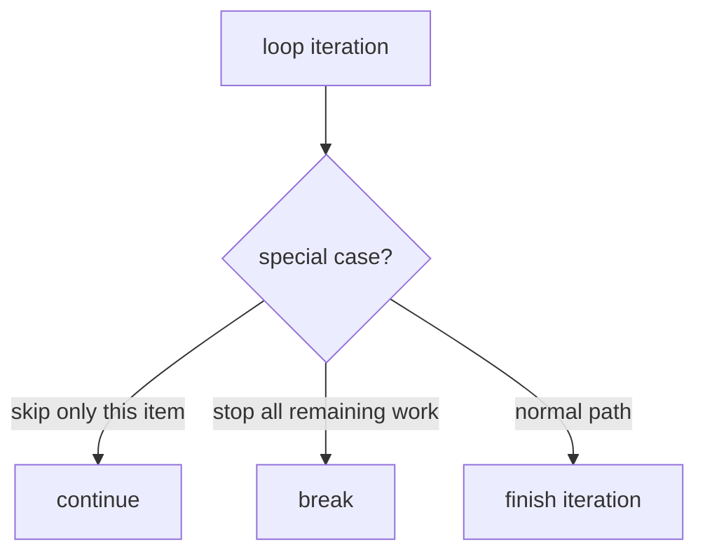

# CF.3 Break / Continue

## Mission

Learn how to change a loop's behavior after the loop has already started.

## Prerequisites

- `CF.2` for basics

## Mental Model

Loop control gives you two important tools:

- `continue` skips the rest of the current iteration
- `break` stops the loop completely

That lets one loop treat different iterations differently.

> **Backward Reference:** In [Lesson 2: For Basics](../2-for-basics/README.md), you learned how to start and stop a loop based on the `for` condition. `break` and `continue` allow you to intervene from *inside* the loop body.

## Visual Model



## Machine View

`continue` jumps to the loop's next iteration step. `break` jumps to the first statement after the loop. Both change normal sequential flow inside the loop body.

## Run Instructions

```bash
go run ./02-language-basics/03-control-flow/3-break-continue
```

## Code Walkthrough

### `if i%2 == 0 { continue }`

This skips even numbers without stopping the overall loop.

### `if i == 7 { break }`

This stops the loop entirely once the target condition is met.

### Order matters

The position of `continue` and `break` checks affects which code can still run during an iteration.

### Loop control is not branching alone

These statements do not just choose code paths. They also change whether the loop keeps going.

> **Forward Reference:** We used `if` statements to decide when to break or continue. Next, we will learn how `switch` can replace multiple `if/else` checks for cleaner discrete branching in [Lesson 4: Switch](../4-switch/README.md).

## Try It

1. Move the `break` check before the `continue` check.
2. Change the stop value from `7` to another number.
3. Remove `continue` and inspect how the output changes.

## In Production
Search loops, filters, validators, and batch processors often depend on early exit and selective skipping. Used well, these tools make code faster and clearer. Used poorly, they hide control flow.

## Thinking Questions
1. When would `break` be the wrong tool if you only want to skip one bad item?
2. Why does the order of loop-control checks matter?
3. What kinds of workloads benefit from stopping early?

## Next Step

Continue to `CF.4` switch.
