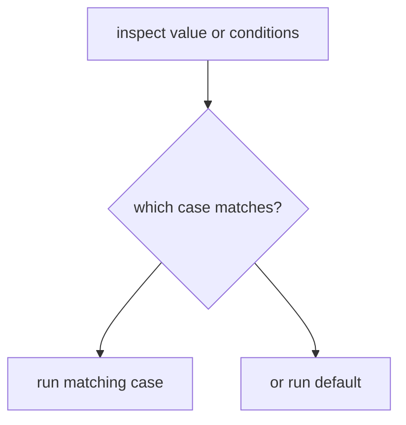

# CF.4 Switch

## Mission

Learn how to choose among several possible paths without building long, hard-to-scan branch chains.

## Prerequisites

- `CF.1` if / else
- `CF.2` for basics

## Mental Model

`switch` is a multi-way branch.

It is useful when:

- one value may match several known cases
- several conditions need a clean top-to-bottom table shape

> **Backward Reference:** In [Lesson 3: Break / Continue](../3-break-continue/README.md), you learned how to interrupt flow. `switch` gives us a built-in "interrupt" automatically: when a case matches, it executes and then implicitly breaks out of the switch block.

## Visual Model



## Machine View

A `switch` evaluates the tag expression or each case condition in order. In Go, once one case matches and runs, the switch ends unless you deliberately use `fallthrough`.

## Run Instructions

```bash
go run ./02-language-basics/03-control-flow/4-switch
```

## Code Walkthrough

### `switch day { ... }`

This form compares one value against several candidate cases.

### `case "Saturday", "Sunday":`

One case can match multiple values when they share the same outcome.

### `switch { ... }`

The tagless form evaluates each case as a boolean condition, which is useful for ranges and guard-like logic.

### `default`

The default case handles the fallback path when no explicit case matches.

> **Forward Reference:** While `switch` simplifies synchronous logic, soon we will learn about `defer` in [Lesson 5: Defer Basics](../5-defer-basics/README.md) to handle cleanup tasks that run at the end of the current scope, regardless of how control flowed through `if`s and `switch`es.

## Try It

1. Change the `day` value and rerun the lesson.
2. Change the `score` value in the tagless `switch`.
3. Reorder the score cases and notice how case order affects behavior.

## In Production
`switch` often makes state machines, command routers, mode handlers, and category-based rules easier to read than long `if / else if` ladders.

## Thinking Questions
1. When is `switch` clearer than `if / else if`?
2. Why is Go's "no fallthrough by default" behavior safer for beginners?
3. What is the difference between a tagged and tagless `switch`?

## Next Step

Continue to `CF.5` defer-basics.
