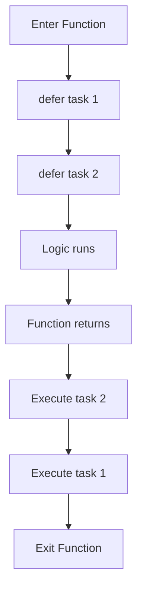

# CF.5 Defer - Mechanics & Order

## Mission

Learn how to schedule work to happen at the very end of a function, ensuring cleanup always runs.

## Why This Lesson Exists Now

As you start writing more complex programs that open files, database connections, or network sockets, you need a way to ensure those resources are closed. If your function has multiple return statements, it's easy to forget to close a resource on one of them. `defer` solves this problem.

## Prerequisites

- `CF.4` switch

## Mental Model

Think of `defer` like a "sticky note" you put on the exit door of a room. No matter what you do in the room or which way you leave, you must perform the task on the note before you walk out.

> **Backward Reference:** In the [Switch](../4-switch/README.md) and [If / Else](../1-if-else/README.md) lessons, control flow executed exactly where the statement was placed. `defer` breaks this by separating *when* the statement is written from *when* the statement executes.

## Visual Model



## Machine View

`defer` pushs a function call onto a stack. When the surrounding function returns, the deferred calls are executed in Last-In-First-Out (LIFO) order.

## Run Instructions

```bash
go run ./02-language-basics/03-control-flow/5-defer-basics
```

## Code Walkthrough

### `defer fmt.Println("Cleaned up!")`

This line schedules the print statement to run after the `main` function finishes its work but before it actually exits.

### Multiple defers

If you have multiple defers, they run in reverse order (LIFO). This is important for things like "close file" then "close database".

> **Forward Reference:** While this lesson focuses purely on the LIFO mechanics of `defer`, we will apply this immediately to practical scenarios like closing files and releasing mutexes in the next lesson, [Lesson 6: Defer Use Cases](../6-defer-use-cases/README.md).

## Try It

1. Add a second `defer` statement and notice the order of execution.
2. Put a `defer` inside an `if` block and see if it runs when the condition is false.
3. Try to use `defer` to print a variable that you change later in the function. (Note: the arguments are evaluated when the `defer` is called, not when it runs!)

## In Production
`defer` is idiomatic Go. It is used in almost every production codebase to handle resource management. It is much safer than manually calling cleanup functions at every return point.

## Thinking Questions
1. Why is Last-In-First-Out (LIFO) the correct order for cleanup?
2. What happens if a function panics? Does `defer` still run?
3. When should you NOT use `defer`?

## Next Step

Continue to `CF.6` defer-use-cases.
