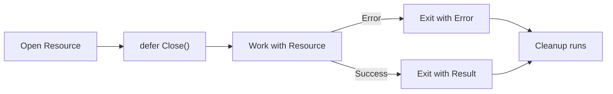

# CF.6 Defer in Real Use Cases

## Mission

See how `defer` is used in production for file cleanup, mutex unlocking, and logging.

## Why This Lesson Exists Now

Understanding the mechanics of `defer` is good, but seeing it applied to real resources makes the concept stick. This lesson bridges the gap between simple prints and real-world resource management.

## Prerequisites

- `CF.5` defer basics

## Mental Model

Think of `defer` as a "safety harness". Before you start a dangerous task (like opening a file), you put on the harness (`defer file.Close()`) so that no matter how the task ends (success or error), you are protected.

## Visual Model



## Machine View

When you `defer` a method call like `file.Close()`, the `file` pointer is captured. Even if the `file` variable is later reassigned or goes out of scope, the deferred call will still operate on the correct object.

## Run Instructions

```bash
go run ./02-language-basics/03-control-flow/6-defer-use-cases
```

## Code Walkthrough

### Simulated File Cleanup

We simulate opening and closing a file. Notice how the "Closing file" message appears even if we "return early" from the work.

### Pair Patterns

Go often uses pairs of functions: `Open/Close`, `Lock/Unlock`, `Begin/Commit`. The second half of the pair should almost always be deferred immediately after the first half succeeds.

## Try It

1. Simulate an error in the "work" section and see if the cleanup still runs.
2. Add a simulated "Lock" and "Unlock" using `defer`.
3. Think about how many return statements you would need to add cleanup to if you didn't use `defer`.

## ⚠️ In Production

Resource leaks (unclosed files or database connections) are a major source of production outages. `defer` is the primary tool Go engineers use to prevent these leaks.

## 🤔 Thinking Questions

1. Why is it better to `defer` cleanup immediately after a successful open?
2. What happens if you `defer` something that could also return an error (like `file.Close()`)?
3. How does `defer` make code with many `if err != nil { return ... }` checks cleaner?

## Next Step

Continue to `CF.7` pricing checkout.
