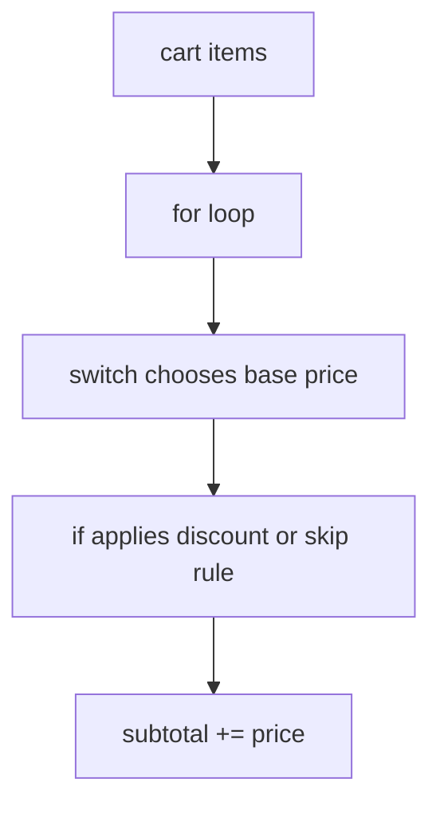

# CF.7 Pricing Checkout

## Mission

Build a small checkout flow that combines branching, loops, `switch`, and `continue` into one runnable program.

## Prerequisites

- `CF.1` if / else
- `CF.2` for basics
- `CF.3` break / continue
- `CF.4` switch
- `CF.5` defer basics
- `CF.6` defer use cases

## Mental Model

This milestone is a miniature rule engine:

- loop over each cart item
- classify the item with `switch`
- apply extra rules with `if`
- skip bad data with `continue`
- accumulate a subtotal

It proves that control flow becomes useful when several decisions interact.

> **Backward Reference:** This final Control Flow milestone combines the looping from [Lesson 2: For Basics](../2-for-basics/README.md), the value matching from [Lesson 4: Switch](../4-switch/README.md), and the loop intervention from [Lesson 3: Break / Continue](../3-break-continue/README.md).

## Visual Model



## Machine View

The program processes one cart item at a time. Each iteration chooses a base price, optionally changes it, may skip invalid items, and then mutates the running subtotal. The loop carries state from one iteration to the next.

## Run Instructions

```bash
go run ./02-language-basics/03-control-flow/7-pricing-checkout
go run ./02-language-basics/03-control-flow/7-pricing-checkout/_starter
```

## Solution Walkthrough

### `cart := []string{ ... }`

The cart provides several inputs so the loop has real work to perform.

### `for _, item := range cart`

The loop applies the same pricing logic to each item code in turn.

### `switch item { ... }`

This assigns a base price for known item codes.

### `if price == 0 { ... continue }`

Unknown items are skipped safely without ending the whole checkout flow.

### `if item == "BOOK" { price = price * 0.90 }`

This extra rule shows that `switch` and `if` solve different kinds of decisions and often work together.

### `subtotal += price`

This is the running-total pattern that accumulates the final result.

> **Forward Reference:** You have now completed the Language Basics and Control Flow sections. In the next major subsystem, [Data Structures](../../04-data-structures/README.md), you will learn how to formally construct and manage collections like the `cart` slice used in this lesson.

## Try It

1. Add another known item code and price rule.
2. Change the book discount and rerun the exercise.
3. Put an unknown item in the middle of the cart and verify it is skipped.

## Verification Surface

```bash
go run ./02-language-basics/03-control-flow/7-pricing-checkout
go run ./02-language-basics/03-control-flow/7-pricing-checkout/_starter
```

The finished program should process the whole cart, price known items correctly, skip unknown items, and print a final subtotal.

## In Production
Checkout logic is exactly where control-flow mistakes become money mistakes. Clear rule ordering, safe skipping, and explicit subtotal updates matter in carts, billing systems, and batch pricing jobs.

## Thinking Questions
1. Why is `continue` a good fit for unknown items here?
2. Why does the discount belong in an `if` instead of inside the `switch` alone?
3. What kinds of bugs happen when the subtotal update is placed in the wrong spot?

## Next Step

Next: `DS.1` -> `02-language-basics/04-data-structures/1-array`

Open `02-language-basics/04-data-structures/1-array/README.md` to continue.
