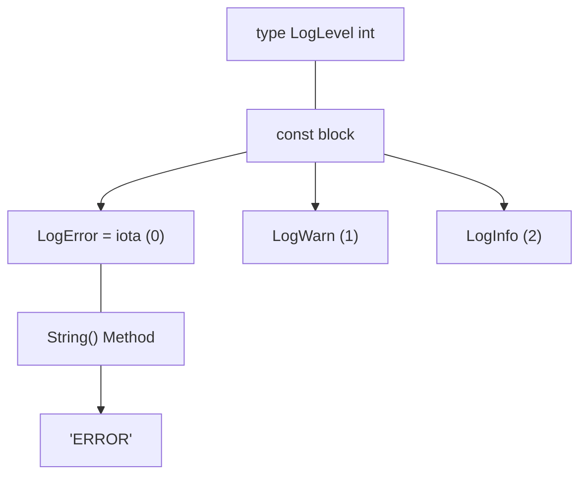

# LB.3 Enums with Iota

## Mission

Learn how Go models enum-like values with named types and `iota`.

## Prerequisites

- `LB.2` constants

## Mental Model

Go does not have a dedicated `enum` keyword. Instead, it combines three features:

1.  **Named Types**: Creates a new type based on an existing one (like `LogLevel` based on `int`).
2.  **Const Blocks**: Groups related categorical values together.
3.  **iota**: An auto-incrementing constant generator.

This combination gives you fixed related values with type safety and readability.

> [!NOTE]
> In [LB.2 Constants](../02-constants/README.md), we learned how grouped constants store static values. Here we combine that with named types to simulate a robust enum structure.

## Visual Model



## Machine View

`iota` is a compiler-level counter. It resets to `0` at the start of every `const` block and increments by `1` for each line. When you wrap these integers in a named type (like `type LogLevel int`), the compiler treats `LogLevel` as a distinct type from a raw `int`, which prevents you from accidentally passing a random number where a specific log level is expected.

## Run Instructions

```bash
go run ./02-language-basics/03-enums
```

## Code Walkthrough

-   **`type LogLevel int`**: Defines a distinct category.
-   **`const ( ... = iota )`**: Automatically assigns sequential numbers.
-   **`iota + 1`**: A common pattern to ensure that the "zero value" of the underlying type is not used for a valid enum value (often used for "Unknown" or "Unset").
-   **`func (l LogLevel) String() string`**: Allows you to print "ERROR" instead of "0", making logs and debug output human-readable.

> [!TIP]
> We will put this pattern to work in the next milestone exercise, [LB.4 Application Logger](../04-application-logger/README.md), where we use our `LogLevel` enum to control real output.

## Try It

1.  Add another enum value (e.g., `LogTrace`) to the `const` block and watch `iota` keep counting.
2.  Create a second named type (e.g., `Status`) with its own `const` block and `iota`.
3.  In `main.go`, try to print an invalid enum value (like `LogLevel(99)`). What does the `String()` method return?

## In Production

Named enum-like values are ubiquitous in Go: HTTP status codes, log levels, file modes, and system states. The `String()` method is particularly important because it ensures that when your code fails and prints its state, you see "STATE_FAILED" instead of an ambiguous number like "4".

## Thinking Questions

1.  Why is a named type (`LogLevel`) safer than using raw integers?
2.  When should an enum start at `1` (`iota + 1`) instead of `0`?
3.  How does the `String()` method help with observability in large systems?

## Next Step

Next: `LB.4` -> [`02-language-basics/04-application-logger`](../04-application-logger/README.md)
