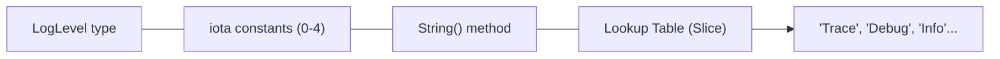

# LB.4 Application Logger

## Mission

Build a small logger that combines variables, constants, `iota`, and methods into one readable program.

## Prerequisites

- `LB.1` variables
- `LB.2` constants
- `LB.3` enums with `iota`

## Mental Model

This exercise turns separate language pieces into one compact system:
-   **Named Type**: Models the categorical log level.
-   **iota Constants**: Creates ordered, machine-friendly values.
-   **String() Method**: Converts internal numeric values into human-friendly output.

This is your first experience composing simple language foundations into a useful engineering artifact.

> [!NOTE]
> This exercise directly combines the concepts from [LB.1 Variables](../01-variables/README.md), [LB.2 Constants](../02-constants/README.md), and [LB.3 Enums](../03-enums/README.md).

## Visual Model



## Machine View

At runtime, the program stores log levels as small integers. The `String()` method translates those integers into human-readable names before printing. A critical "bounds check" ensures that if an invalid number is passed, the program returns a safe fallback ("Unknown") instead of attempting to access an invalid memory index.

## Run Instructions

```bash
go run ./02-language-basics/04-application-logger
```

## Solution Walkthrough

-   **`type LogLevel int`**: Creates a named category.
-   **`const ( ... LogLevel = iota )`**: Assigns stable numeric values.
-   **`var levelNames = []string{...}`**: A lookup table mapping numeric levels to text.
-   **`func (l LogLevel) String() string`**: The translation logic. It checks `if l < LevelTrace || l > LevelError` to ensure safety.
-   **`printLogLevel(...)`**: A helper function to centralize output formatting.

> [!TIP]
> Now that you have a solid foundation in variables and types, you are ready to learn how to direct program execution using [CF.1 If / Else](../03-control-flow/01-if-else/README.md).

## Try It

1.  Add another log level (e.g., `LevelFatal`) to the `const` block and the `levelNames` slice.
2.  In `main.go`, pass an invalid number to `printLogLevel(100)` and verify it shows "Unknown".
3.  Change the format in `printLogLevel` to include the current system time (simulated with a string).

## Verification Surface

Run the completed program:
```bash
go run ./02-language-basics/04-application-logger
```

Expected output:
```text
Log level: 0 Trace
Log level: 1 Debug
Log level: 2 Info
Log level: 3 Warning
Log level: 4 Error
Log level: 10 Unknown
```

## In Production

Real-world logging systems (like `zap` or `logrus`) use this exact pattern. Stable internal IDs allow machines to filter logs efficiently, while human-readable strings ensure that engineers can debug systems quickly during an incident.

## Thinking Questions

1.  Why is it useful to separate the stored level (int) from the displayed level name (string)?
2.  What would happen if the `String()` method didn't check the bounds of the `levelNames` slice?
3.  How does this pattern make the logger easier to extend in the future?

## Next Step

Next: `CF.1` -> [`02-language-basics/03-control-flow/01-if-else`](../03-control-flow/01-if-else/README.md)
