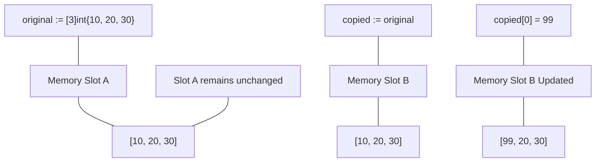

# DS.1 Arrays

## Mission

Learn what an array is in Go and why arrays matter even though slices are the more common tool in practice.

## Prerequisites

- `CF.2` For Basics (Loops)

## Mental Model

An array is a fixed-size collection of elements of the same type. In Go, an array is a **value**.
This means:
- The size (length) is part of the type (`[2]int` is different from `[3]int`).
- Copying an array copies **every single element**.
- Passing an array to a function passes a full copy, not a reference.

> [!NOTE]
> In the final Control Flow lesson, [CF.7 Pricing Checkout](../../03-control-flow/07-pricing-checkout/README.md), you iterated over a list of items. Before we dive into dynamic slices, we must understand the fundamental fixed-size Array that sits underneath them.

## Visual Model



## Machine View

When you declare `[100]int`, the Go compiler allocates exactly enough contiguous memory for 100 integers on the stack (or heap depending on scope). Accessing `arr[5]` is extremely fast because the computer simply calculates: `BaseAddress + (5 * size_of_int)`. However, copying large arrays is expensive because the CPU must physically move every byte from one location to another.

## Run Instructions

```bash
go run ./02-language-basics/04-data-structures/01-array
```

## Code Walkthrough

- **`var numbers [2]int`**: Declares an array. The size `2` is mandatory and fixed.
- **`primes := [4]int{2, 3, 5, 7}`**: Initializes an array literal.
- **`for i, value := range primes`**: Iterates over the array, providing both the index and a **copy** of the value at that index.
- **`copied := original`**: This is the most important part of the lesson. It demonstrates that `original` and `copied` are two distinct blocks of memory.

> [!TIP]
> Now that you understand that Arrays are fixed-size and copy-by-value, you will see exactly why Go provides a more dynamic tool for everyday use in [DS.2 Slices](../02-slices/README.md).

## Try It

1. In `main.go`, change `var numbers [2]int` to `var numbers [3]int`. You will see a compiler error if you don't update the assignments as well.
2. Change `copied[0] = 99` to `original[0] = 99` and observe how `copied` remains unchanged.
3. Try to compare two arrays of different sizes (e.g., `[2]int == [3]int`). The compiler will not allow it because they are different types.

## In Production

You will rarely use arrays for dynamic business data (use Slices instead). However, arrays are excellent for fixed-size mathematical vectors, crypto keys (e.g., `[32]byte`), or low-level buffers where you want to guarantee that no heap allocation occurs.

## Thinking Questions

1. Why is the size `[5]` considered part of the type in Go?
2. What are the performance implications of copying a very large array (e.g., `[1000000]int`)?
3. In what scenario would you *want* the value-copy behavior of an array?

## Next Step

Next: `DS.2` -> [`02-language-basics/04-data-structures/02-slices`](../02-slices/README.md)
