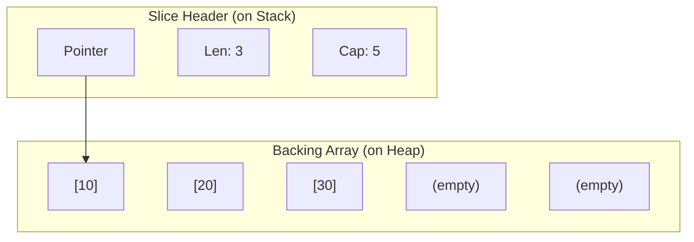

# DS.2 Slices

## Mission

Learn how Go represents dynamic collections through slices, and why `len`, `cap`, `make`, and `append` are all part of one connected idea.

## Prerequisites

- `DS.1` arrays

## Mental Model

A slice is a dynamic, flexible view into the elements of an array. Unlike arrays, slices are not fixed in size.
A slice is actually a small structure (a "header") that tracks three things:
1.  **Pointer**: Where the data starts in memory (the underlying array).
2.  **Length (`len`)**: How many elements are currently in the slice.
3.  **Capacity (`cap`)**: How many elements the underlying array can hold before it needs to grow.

> [!NOTE]
> In [DS.1 Arrays](../01-array/README.md), you learned that arrays are rigid, fixed-size structures. Slices solve this rigidity by acting as dynamic descriptors over those underlying arrays.

## Visual Model



## Machine View

When you call `append(slice, val)`, Go checks if `len + 1 <= cap`.
-   If **Yes**: It simply updates the backing array at the next index and increments the length.
-   If **No**: It performs a "reallocation"—it creates a new, larger array, copies all existing data to it, updates the pointer in the slice header, and then adds the new value.
This is why `append` must always be assigned back to the variable: `s = append(s, val)`.

## Run Instructions

```bash
go run ./02-language-basics/04-data-structures/02-slices
```

## Code Walkthrough

- **`names := []string{...}`**: A slice literal. Note the empty brackets `[]`—this distinguishes it from an array.
- **`make([]int, 0, 3)`**: Pre-allocates a backing array of size 3 but starts with an empty view (length 0). This is a performance optimization.
- **`items = append(items, 40)`**: This forces the slice to grow beyond its initial capacity.
- **`items[:2]`**: Creates a sub-slice. This new header points to the *same* memory as the original. Changing a sub-slice element changes the original!

> [!TIP]
> Slices are the primary sequential data structure in Go. However, if you need to look things up by a unique key rather than a position, you should use [DS.3 Maps](../03-maps/README.md).

## Try It

1. In `main.go`, change `make([]int, 0, 3)` to `make([]int, 5, 5)`. Notice how the slice is no longer empty at the start.
2. Slicing: create `subset := items[1:3]` and print it.
3. Mutation: change `subset[0] = 999` and then print the original `items`. Do you see the change?

## In Production

99% of your collection work in Go will use slices.
- **Optimization**: Always use `make` with a known capacity if you know how many items you're going to add. This prevents expensive reallocations.
- **Safety**: Be careful when slicing large arrays; the original array stays in memory as long as any slice points to it.

## Thinking Questions

1. Why does `append` return a new slice header instead of modifying the existing one in place?
2. What is the relationship between a slice and its "backing array"?
3. Why is `make([]int, 0, 100)` faster than calling `append` 100 times on an empty slice?

## Next Step

Next: `DS.3` -> [`02-language-basics/04-data-structures/03-maps`](../03-maps/README.md)
