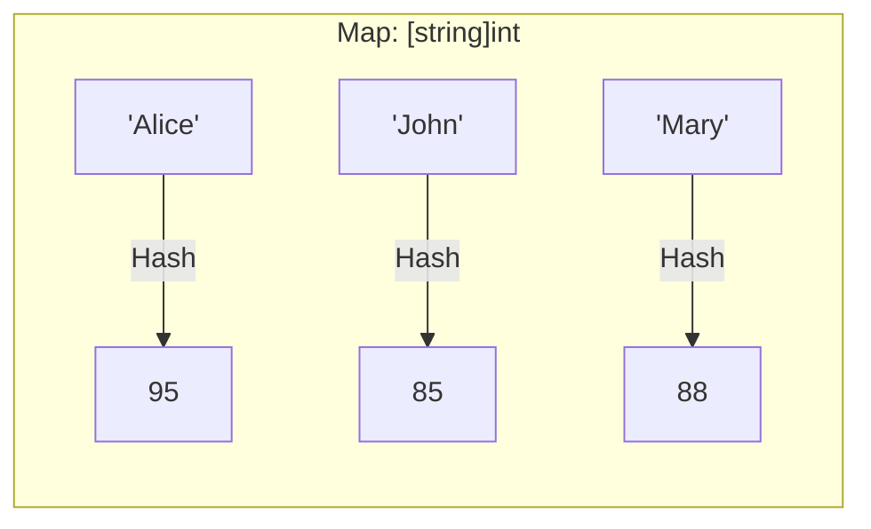

# DS.3 Maps

## Mission

Learn how Go performs keyed lookup with maps and why the "comma-ok" pattern is essential for distinguishing between zero values and missing data.

## Prerequisites

- `DS.2` slices

## Mental Model

A map is an unordered collection of **Key-Value pairs**.
Think of it like a real-world dictionary:
- You look up a **Key** (the word).
- You retrieve the **Value** (the definition).

In a slice, you find data by its **Position** (index). In a map, you find data by its **Identity** (key).

> [!NOTE]
> In [DS.2 Slices](../02-slices/README.md), you learned to store sequences accessed by numeric index. Maps complement slices by allowing semantic keys like strings, IDs, or categories.

## Visual Model



## Machine View

A map is implemented as a **Hash Table**.
1. When you request `map["Alice"]`, Go runs a "hash function" on the string `"Alice"` to get a unique number.
2. That number points directly to a "bucket" in memory where the value `95` is stored.
3. This process takes the same amount of time regardless of whether the map has 10 items or 10 million items (O(1) complexity).

## Run Instructions

```bash
go run ./02-language-basics/04-data-structures/03-maps
```

## Code Walkthrough

- **`map[string]int{...}`**: Declares a map where keys are strings and values are integers.
- **`delete(m, "key")`**: Built-in function to remove an entry. If the key doesn't exist, it does nothing (safe).
- **Zero Value behavior**: If you look up a missing key, Go returns the **Zero Value** of the value type (e.g., `0` for `int`).
- **Comma-ok Pattern**: `val, ok := m["key"]`. 
  - `val` is the value.
  - `ok` is a boolean that is `true` if the key exists, and `false` if it doesn't. This is how you tell the difference between "the score is 0" and "the student doesn't exist."

> [!TIP]
> Data structures store values, but to share those values efficiently without constantly copying them, you need to understand memory addresses. In [DS.4 Pointers](../04-pointers/README.md), you will learn how to reference memory directly.

## Try It

1. In `main.go`, add a new student "Bob" with a score of `0`.
2. Perform a lookup for "Bob" using the comma-ok pattern. Is `ok` true or false?
3. Delete "Alice" and then try to look her up again.

## In Production

Maps are the heart of caches, configuration registries, and session managers.
- **Safety**: Maps are **not** safe for concurrent use by default (multiple things changing them at once). You'll learn to handle this later.
- **Iteration**: Iterating over a map with `range` returns keys in a **random order** every time. Never rely on map order!

## Thinking Questions

1. Why is the "comma-ok" pattern more important for maps than for slices?
2. Why is map lookup faster than searching through a slice for a specific ID?
3. Why does Go deliberately randomize the order when you loop over a map?

## Next Step

Next: `DS.4` -> [`02-language-basics/04-data-structures/04-pointers`](../04-pointers/README.md)
