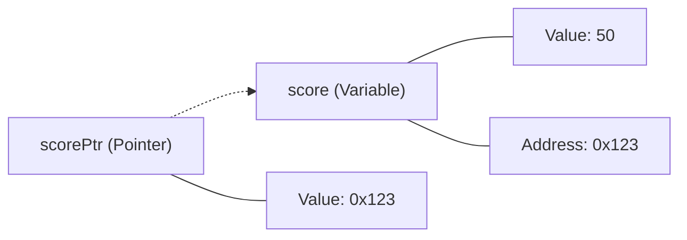

# DS.4 Pointers

## Mission

Learn what a pointer is, how dereferencing works, and why pointers matter when an update must change the original stored value rather than a copy.

## Prerequisites

- `DS.1` arrays
- `DS.2` slices

## Mental Model

A pointer is a variable that stores the **Memory Address** of another value.
- **Address-of (`&`)**: "Tell me where this variable lives in memory."
- **Dereference (`*`)**: "Go to that address and show/change the value stored there."

Use pointers when you need different parts of your program to share and update the same data.

> [!NOTE]
> In [DS.3 Maps](../03-maps/README.md), you used a built-in reference type. Pointers allow you to create your own references to any data type (integers, strings, etc.).

## Visual Model



## Machine View

At the machine level, everything is just an address in RAM.
- A normal variable like `int` stores a number.
- A pointer variable stores a memory offset (usually 64 bits on modern systems).
- When you "dereference" a pointer, the CPU takes that 64-bit offset and performs a "load" or "store" instruction at that specific location.
Go ensures safety by preventing "pointer arithmetic" (you can't manually add `1` to an address to see what's next in memory).

## Run Instructions

```bash
go run ./02-language-basics/04-data-structures/04-pointers
```

## Code Walkthrough

- **`scorePtr := &score`**: Creates a pointer pointing to `score`.
- **`*scorePtr = 95`**: Updates the original `score` by visiting its address.
- **`scoreCopy := score`**: Creates a new, independent copy in memory.
- **`nil`**: The zero value for a pointer. It means "pointing to nothing." Always check for `nil` before dereferencing to avoid a program crash (panic).

> [!TIP]
> Now that you've seen pointers and basic slices, we will combine these concepts to see what happens when multiple slices share the same underlying memory in [DS.5 Slices in Depth](../05-slices-2/README.md).

## Try It

1. In `main.go`, change `score` to `100` and watch `*scorePtr` reflect the change automatically.
2. Create a new pointer `anotherPtr := scorePtr`. Both now point to the same `score`. Update it through one and read it through the other.
3. Try to dereference `optionalScore` without the `if == nil` check and see the program crash.

## In Production

Pointers are critical for:
- **Efficiency**: Passing a large data structure by pointer avoids copying megabytes of data.
- **Shared State**: Allowing multiple functions to update the same record (e.g., a User profile).
- **Optional Values**: A pointer can be `nil`, whereas a plain `int` is always at least `0`. This is useful for representing "no data."

## Thinking Questions

1. What is the difference between `scorePtr` and `*scorePtr`?
2. Why is a `nil` pointer dangerous if not checked?
3. In what scenario is it better to pass a copy of a value instead of a pointer to it?

## Next Step

Next: `DS.5` -> [`02-language-basics/04-data-structures/05-slices-2`](../05-slices-2/README.md)
