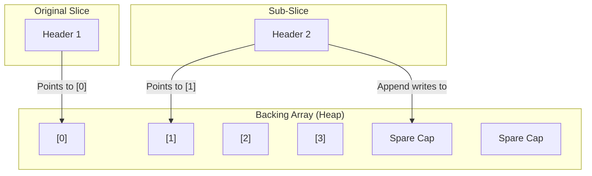

# DS.5 Slices in Depth

## Mission

Learn why sub-slices can still affect the original data and why `append` can reuse spare capacity in ways that surprise beginners.

## Prerequisites

- `DS.2` slices
- `DS.4` pointers

## Mental Model

A sub-slice is **not a copy**. It is a new slice header pointing to the **same backing array**.
- If you change a value in the sub-slice, it changes in the original.
- If you `append` to a sub-slice and there is still **capacity** in the backing array, the original array will be overwritten!

This is the most common "gotcha" in Go data processing. To avoid this, you must explicitly **Copy** the data if you want an independent collection.

> [!NOTE]
> In [DS.2 Slices](../02-slices/README.md), you learned the basics of slice creation. In [DS.4 Pointers](../04-pointers/README.md), you learned how multiple variables can reference the same memory. Here we see those two concepts combine in the slice's "hidden" backing array.

## Visual Model



## Machine View

When you slice `original[1:4]`, Go creates a header with:
- `Pointer`: address of `original[1]`
- `Len`: 3
- `Cap`: `cap(original) - 1` (the remaining space in the array).
As long as the sub-slice has `cap > len`, an `append` will modify the existing backing array. Once `len == cap`, the next `append` will trigger a **reallocation**, and only *then* will the sub-slice get its own independent memory.

## Run Instructions

```bash
go run ./02-language-basics/04-data-structures/05-slices-2
```

## Code Walkthrough

- **`shared := original[1:4]`**: Creating the shared view.
- **`shared[0] = 100`**: Modifying the view affects the source.
- **`append(growth, 200)`**: Overwriting the original array's data because spare capacity existed.
- **`copy(independent, source)`**: The safe way. `make` a new slice and use the `copy` built-in to move the values to a separate memory location.

> [!TIP]
> Now that you understand the mechanics and edge cases of arrays, slices, maps, and pointers, it's time to put them together. In the final lesson of this section, [DS.6 Contact Manager](../06-contact-manager/README.md), you will use all of these structures to build a working, composite data model.

## Try It

1. In `main.go`, print the capacity of the `shared` slice. Notice it's larger than its length.
2. Change the range in `original[1:4]` and see how the capacity changes.
3. Try to use the `copy()` function to copy only the first two elements of `original` into a new slice.

## In Production

Experienced Go developers are always wary of "Slice Aliasing" (multiple slices sharing the same array). In critical systems, we often use the "Full Slice Expression" `a[low:high:max]` to limit the capacity of a sub-slice, forcing an `append` to reallocate immediately and preventing accidental corruption of the source data.

## Thinking Questions

1. Why is slicing designed to be a "view" by default instead of a "copy"?
2. What happens to the "connection" between two slices once one of them reallocates due to an `append`?
3. How does the `copy()` function prevent accidental data mutation?

## Next Step

Next: `DS.6` -> [`02-language-basics/04-data-structures/06-contact-manager`](../06-contact-manager/README.md)
