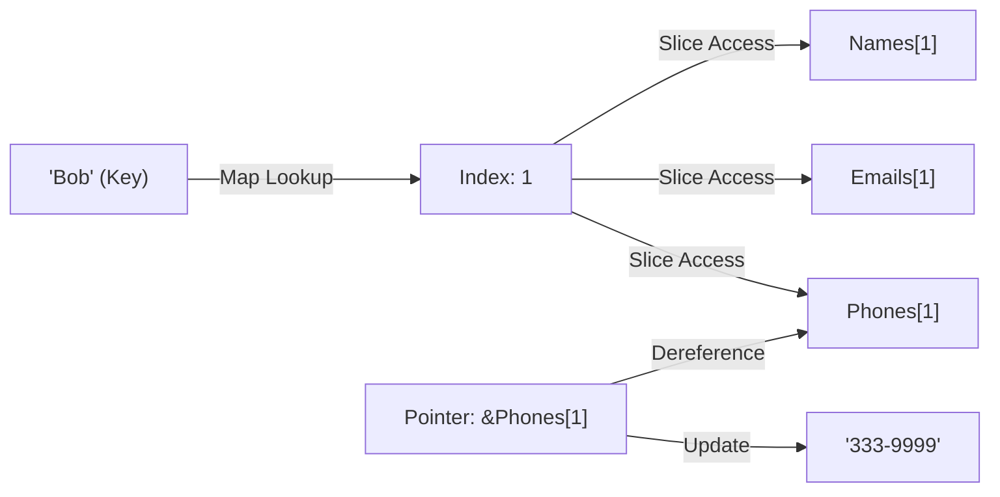

# DS.6 Contact Directory

## Mission

Build an in-memory contact registry that combines slices, maps, and pointers into a single functional program.

## Prerequisites

- `DS.1` through `DS.5`

## Mental Model

This milestone uses three distinct data-structure roles to build a miniature database:
1.  **Slices (Storage)**: Store names, emails, and phone numbers in ordered collections.
2.  **Maps (Index)**: Provide an $O(1)$ fast lookup from a "Name" to its "Slice Index".
3.  **Pointers (Mutation)**: Allow you to update a specific record in the slice without copying the whole collection.

> [!NOTE]
> In [DS.5 Slices in Depth](../05-slices-2/README.md), you learned about the dangers of shared memory. In this exercise, you will intentionally use pointers (from [DS.4](../04-pointers/README.md)) and maps (from [DS.3](../03-maps/README.md)) to manage memory explicitly and safely.

## Visual Model



## Machine View

- **Slices**: Maintain contiguous blocks of memory for data storage.
- **Maps**: Store pointers or integers (indexes) that link a semantic key to a specific offset in those slices.
- **Pointers**: `&phones[index]` calculates the physical RAM address of a slice element. Dereferencing it with `*` performs a direct memory write to that address, ensuring the update persists in the original backing array.

## Run Instructions

```bash
go run ./02-language-basics/04-data-structures/06-contact-manager
```

## Solution Walkthrough

- **Parallel Slices**: We use separate slices for names, emails, and phones. While not ideal for complex apps, it makes the data structure interactions clear for beginners.
- **`indexByName`**: This map acts as our "Primary Index".
- **Duplicate Guard**: Using `_, exists := indexByName[name]` to prevent adding the same contact twice.
- **The Update**: We find the index via the map, take a pointer to the phone slice at that index, and update it.

> [!TIP]
> In this module, we used "parallel slices" because you don't know how to create custom composite types yet. In [Section 03: Functions & Errors](../../../03-functions-errors/README.md), you will learn how to encapsulate logic, and in Section 04, we'll replace these parallel slices with proper **Structs**.

## Try It

1. In `main.go`, add yourself as a new contact.
2. Update your email address through a pointer (take the address of the element in the `emails` slice).
3. Try to look up a contact that doesn't exist and ensure the program handles it gracefully using the `comma-ok` pattern.

## Verification Surface

Run the program:
```bash
go run ./02-language-basics/04-data-structures/06-contact-manager
```

Expected output:
```text
=== Contact Directory ===
Duplicate add skipped for Alice Wonderland.

--- Listing Contacts ---
1. Alice Wonderland | alice@example.com | 111-2222
2. Bob The Builder | bob@example.com | 333-4444
3. Charlie Brown | charlie@example.com | 555-6666

--- Lookup and Update ---
Found Bob at index 1 with phone 333-4444
Updated Bob through pointer: 333-9999
Persisted Bob phone: 333-9999
Zack not found.
```

## In Production

Real-world database engines (like SQLite or Postgres) use similar patterns of "Indices" and "Data Pages".
- **Speed**: Maps allow you to find one record among billions in constant time.
- **Consistency**: Pointers ensure that when you update a record, all "Views" of that data see the update immediately.

## Thinking Questions

1. Why does the map store an **Index** (`int`) rather than the phone number string itself?
2. What would happen if we updated a copy of the phone number instead of using a pointer?
3. How would you handle a situation where a contact's name changes? (Hint: You'd need to update the map key).

## Next Step

Next: `DS.7` -> [`02-language-basics/04-data-structures/07-slices`](../07-slices/README.md)
